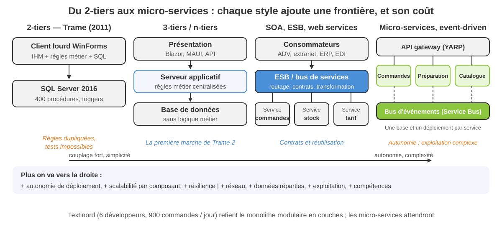
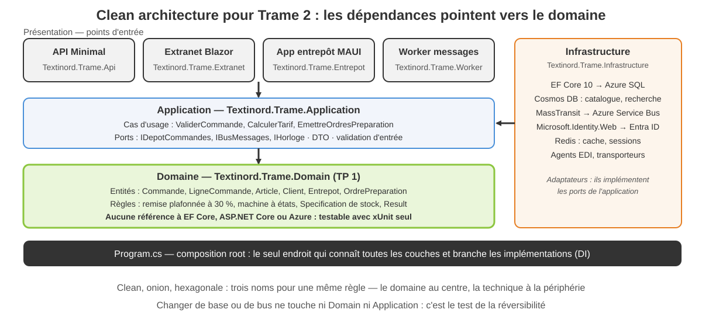
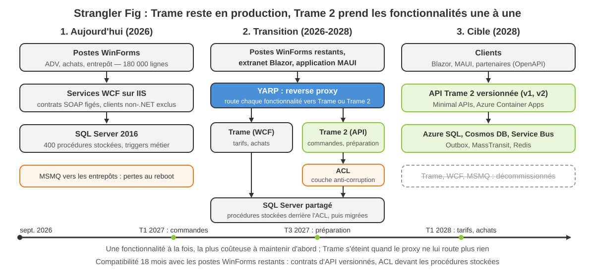

<!-- _class: lead -->

# Module 1

## Architecturer un SI .NET : styles, couches et design patterns

Architectures d'entreprise avec les technologies Microsoft

Jour 1, matin — 3 h 30

---

<!-- _class: dense -->

## Objectifs du module

À la fin de cette demi-journée, vous serez capable de :

- **Juger** une architecture avec des critères explicites (ISO 25010, coût du changement, réversibilité) et tracer la décision dans un ADR
- **Nommer** les styles — 2-tiers, n-tiers, SOA, REST, micro-services, monolithe modulaire, clean architecture — et choisir avec des critères
- **Découper** une application en couches : données, métier, présentation, transverses, avec IoC et bootstrapper
- **Appliquer** SOLID et les design patterns de base en C# 14
- **Reconnaître** les patterns de Fowler (PoEAA) derrière EF Core et ASP.NET Core

<div class="key">

Fil rouge : **Textinord** et son projet Trame 2. Le TP 1 pose le noyau métier `Textinord.Trame.Domain` que les modules 2 à 6 réutilisent.

</div>

---

<!-- _class: tight -->

## Plan de la demi-journée

1. **Pourquoi architecturer** — coût du changement, critères, SI d'entreprise, abstraction, ADR
2. **Architecture logicielle** — vocabulaire, styles, couches, IoC, scalabilité, migration
3. **Design patterns de base** — SOLID, création, structure, comportement, avancés
4. **Design patterns spécialisés** — Fowler : données, ORM, présentation web, communication, concurrence

Ateliers : Démo 1.1 (refactoring SOLID du tarif), Exercice 1.1 (choisir un style), Exercice 1.2 (violations SOLID), TP 1 (diagnostic de Trame et noyau métier de Trame 2).

<div class="key">

**Textinord**, Roubaix : 180 salariés, 1 200 clients professionnels, 40 000 références, 900 commandes par jour en pointe. Son SI de commandes « Trame » (WinForms .NET Framework 4.8, WCF, MSMQ, SQL Server) doit devenir « Trame 2 » (.NET 10, ASP.NET Core, Blazor, MAUI, EF Core, Azure).

</div>

---

<!-- _class: lead -->

# 1. Pourquoi architecturer

---

<!-- _class: tight -->

## Trame en 2026 : le coût du changement

- 180 000 lignes de WinForms en code-behind, **aucune couche métier isolée** : la règle de remise existe en C# et en T-SQL, et les deux divergent
- Tests automatisés : zéro. Mise en production **trimestrielle**, régressions à chaque livraison, copie manuelle sur les serveurs
- Deux développeurs historiques détiennent la connaissance ; Nadia Benali (DSI) parle de « dépendance à deux personnes »
- .NET Framework 4.8.1 en maintenance seule ; WCF, MSMQ, Web Forms : sans successeur dans .NET 10
- Une évolution simple — remise volume de 5 % au-delà de 500 pièces — a coûté 3 semaines : 4 écrans, 2 procédures stockées, 1 trigger

<div class="key">

Architecturer, c'est **aplatir la courbe du coût du changement** : payer un peu de structure maintenant pour que la 200e évolution coûte à peu près autant que la 20e.

</div>

---

<!-- _class: packed -->

## Les critères d'une bonne architecture

| Qualité (ISO 25010) | La question à poser | Cible pour Trame 2 |
|---|---|---|
| Maintenabilité | combien coûte la 200e évolution ? | noyau métier testé, couches nettes |
| Performance | quel P95, à quelle charge ? | stock < 300 ms P95, 900 commandes / jour |
| Sécurité | qui accède à quoi, et comment on le prouve ? | Entra ID, OIDC, moindre privilège |
| Fiabilité | que se passe-t-il quand un composant tombe ? | 99,9 %, messages persistés, retry |
| Évolutivité | comment absorber trois fois la charge ? | stateless, cache, scale-out |
| Observabilité | sait-on ce qui se passe en production ? | logs structurés, traces, métriques |
| Coût | combien pour construire, puis pour exploiter ? | PaaS d'abord, pas d'AKS au départ |
| Réversibilité | peut-on revenir en arrière, changer de fournisseur ? | contrats, ports, ADR |

Une architecture n'est jamais bonne dans l'absolu : elle est bonne **pour des critères explicites et classés**. Les classer, c'est le vrai travail de Julien Delcourt.

---

<!-- _class: tight -->

## Le SI d'entreprise de Textinord

Un **système d'information** : l'ensemble des applications, données, flux et acteurs qui font tourner l'entreprise — pas une application. Architecturer un SI commence par le **cartographier**.

| Domaine | Application | Échanges |
|---|---|---|
| Commandes, achats, entrepôt | Trame (WinForms + WCF) | MSMQ vers les entrepôts, EDI avec 20 grands comptes |
| Vente B2C | site Web Forms | commandes ressaisies à la main dans Trame |
| Comptabilité, paie | ERP externe (SaaS) | export de fichiers chaque nuit |
| Annuaire, droits | Active Directory | groupes AD lus directement par Trame |
| Logistique | scanners Windows Mobile | files MSMQ locales, sans supervision |

Chaque case est une **frontière** : un contrat, un propriétaire, un cycle de vie. C'est là que se prennent les décisions d'architecture.

---

<!-- _class: tight -->

## L'abstraction : contrats, interfaces, couches

Abstraire, c'est **cacher un choix derrière un contrat** pour pouvoir le changer. Trois niveaux :

- le **contrat** (interface, schéma d'API, format de message) décrit le besoin du consommateur, pas la solution du fournisseur
- la **couche** regroupe les contrats de même nature : données, métier, présentation
- le **composant** est ce qu'on remplace : une implémentation, un service, un fournisseur

```csharp
public interface IPolitiqueRemise          // ce dont le métier a besoin
{
    string ConditionTarifaire { get; }
    decimal TauxPour(int quantite);
}
// Trame    : if (condition == "COL") remise = 0.10m; else if ... (x 4 écrans)
// Trame 2  : une classe par condition ; ajouter « Hôpital » = une classe de plus
```

---

<!-- _class: tight -->

## Ingénierie ou technicité : décider avec un ADR

- **Technicité** : « on passe en micro-services, tout le monde le fait ». **Ingénierie** : « voici le besoin, les options, les critères, la décision et ses conséquences »
- Julien Delcourt doit trancher trois choix avant octobre : style, découpage, migration. Un **ADR** (Architecture Decision Record) par décision : une page, numérotée, immuable une fois acceptée

```text
# ADR-003 — Migration progressive de Trame par Strangler Fig
Statut : accepté (07/09/2026)   Décideurs : J. Delcourt, N. Benali, S. Marques
Contexte : Trame reste en production 18 mois ; une réécriture = 2 ans sans valeur
Options : (a) big bang  (b) Strangler Fig derrière YARP  (c) ne rien faire
Décision : (b) — bascule fonctionnalité par fonctionnalité, commandes en premier
Conséquences : double exploitation 18 mois ; ACL devant les procédures stockées ;
               contrat d'API versionné dès la v1 ; un ADR par fonctionnalité migrée
```

---

<!-- _class: lead -->

# 2. Architecture logicielle

---

<!-- _class: tight -->

## Vocabulaire : couche, module, composant, service

| Terme | Définition | Dans Trame 2 |
|---|---|---|
| Couche | regroupement **technique** : même rôle, mêmes règles de dépendance | Domain, Application, Infrastructure, Api |
| Module | regroupement **fonctionnel** : un sous-domaine, ses règles, ses données | Commandes, Catalogue, Préparation, Tarification |
| Composant | unité déployable ou remplaçable, avec un contrat | `Textinord.Trame.Domain.dll`, un conteneur |
| Service | composant exposé à distance derrière un contrat réseau | API commandes, service de stock |
| Fournisseur / consommateur | qui publie le contrat / qui en dépend | API Trame 2 → extranet, MAUI, partenaires EDI |

Organisation **technique** (par couche) et **fonctionnelle** (par module) se combinent : un module traverse les couches, une couche contient tous les modules. Le contrat appartient au fournisseur, mais se conçoit avec le consommateur.

---

<!-- _class: visual -->

## Du 2-tiers aux micro-services



---

<!-- _class: packed -->

## Styles d'architecture : les critères de choix

| Style | Ce qu'il apporte | Ce qu'il coûte | Pour Textinord |
|---|---|---|---|
| 2-tiers (client lourd + BDD) | simple, rapide à livrer en 2011 | logique dupliquée, aucun test | jamais pour du neuf |
| 3-tiers / n-tiers | règles centralisées sur un serveur | un déploiement unique | la base de Trame 2 |
| SOA, ESB, web services | contrats, réutilisation, bus de routage | l'ESB devient un point central lourd | intégration ERP, EDI |
| WOA / REST | HTTP, JSON, OpenAPI, clients non-.NET | pas de transaction distribuée | l'API Trame 2 |
| Micro-services | déploiement et scalabilité par service | exploitation, données réparties, réseau | 6 développeurs : pas encore |
| Monolithe modulaire | modules étanches, un déploiement | discipline sur les références | **le choix de Trame 2** |
| Event-driven | découplage temporel, résilience | cohérence à terme, débogage | ordres de préparation |

Les **vertical slices** (une tranche par fonctionnalité) organisent l'intérieur de la couche Application ; elles ne remplacent pas le style.

---

<!-- _class: visual -->

## Clean architecture pour Trame 2



---

<!-- _class: tight -->

## Les couches et ce qu'on y met

| Couche | Contenu | Exemple Trame 2 |
|---|---|---|
| Accès aux données | repositories, `DbContext`, requêtes, mapping | `DepotCommandes` sur EF Core, requête Dapper de stock |
| Métier — entités | objets porteurs des règles et de l'état | `Commande`, `LigneCommande`, `Article`, `Client` |
| Métier — services | règles qui ne vivent dans aucune entité | `CalculRemise`, affectation des entrepôts |
| Métier — agents | adaptateurs vers un système externe | agent EDI grands comptes, agent transporteur |
| Métier — workflows | machines à états, orchestrations | cycle Brouillon → Facturee, saga de préparation |
| Présentation | API, Blazor, MAUI, worker : entrée et sortie | `Textinord.Trame.Api`, extranet, scanner |
| Transverses | logging, cache, configuration, sécurité, résilience | `ILogger<T>`, `IOptions<T>`, Polly, `IDistributedCache` |

Une règle par ligne : le code métier ne référence aucun paquet technique ; les transverses s'injectent, elles ne s'héritent pas.

---

<!-- _class: tight -->

## IoC, injection de dépendances et bootstrapper

- **Inversion de contrôle** : la classe ne crée plus ses dépendances, elle les **reçoit** ; le conteneur `Microsoft.Extensions.DependencyInjection` les fabrique et gère leur durée de vie
- Le **bootstrapper** (`Program.cs`, Generic Host, `WebApplicationBuilder`) est la seule pièce qui connaît toutes les implémentations
- **Plug-ins** : `AssemblyLoadContext` charge un assembly à chaud (un agent EDI par grand compte) ; `System.Composition` découvre les exports

```csharp
var builder = Host.CreateApplicationBuilder(args);
builder.Services.AddSingleton<IReferentielClients, ReferentielClientsSql>();
builder.Services.AddSingleton<IPolitiqueRemise, RemiseCollectivite>();
builder.Services.AddSingleton<IPolitiqueRemise, RemiseGrandCompte>();
builder.Services.AddTransient<CalculateurTarif>(); // reçoit IEnumerable<IPolitiqueRemise>
using var host = builder.Build();
```

Durées de vie (singleton, scoped, transient) et pièges : module 5.

---

<!-- _class: tight -->

## Scalabilité : stateless, cache, CQRS

- **Verticale** : une machine plus grosse — simple, plafonnée, un seul point de panne
- **Horizontale** : n instances derrière un équilibreur — exige des services **stateless** : aucune session en mémoire, l'état vit dans Redis, SQL ou le jeton
- **Cache** : Redis pour le catalogue (40 000 références, lues 15 000 fois par jour, modifiées 50 fois) ; jamais pour le stock temps réel
- **CQRS** : séparer le modèle d'écriture (validation, règles) du modèle de lecture (liste des commandes d'un client, projection dénormalisée) — sans event sourcing par défaut
- **Asynchrone** : l'ordre de préparation part sur un bus ; l'API répond en 300 ms au lieu d'attendre l'entrepôt de Lesquin

<div class="key">

Objectif Textinord : 99,9 % de disponibilité, P95 < 300 ms sur le stock. 900 commandes par jour ne justifient pas des micro-services, mais justifient stateless + cache dès la v1.

</div>

---

<!-- _class: visual -->

## Migration progressive : le Strangler Fig



---

<!-- _class: dense -->

## Compatibilité, identité, asynchronisme : aperçu

- **Compatibilité descendante** : contrats versionnés (`/api/v1/commandes` maintenu 18 mois), champs ajoutés jamais retirés, **Anti-Corruption Layer** qui traduit le modèle de Trame vers celui de Trame 2 — détaillé au module 6
- **Authentification et fédération** : plus de groupes AD lus en direct ; OpenID Connect avec Microsoft Entra ID (salariés, hybride Entra Connect) et Entra External ID (clients, partenaires) ; l'API reçoit un jeton, jamais un mot de passe — module 5
- **Asynchronisme** : `async`/`await` de bout en bout, `BackgroundService` pour les traitements longs, messaging (Service Bus, MassTransit) pour découpler — module 2

<div class="warn">

Legacy à ne pas reproduire : WCF, MSMQ, COM+ / DTC, WIF et Web Forms n'existent pas dans .NET 10. Chemin de migration : REST ou gRPC, Service Bus, Outbox, OIDC, Blazor.

</div>

---

<!-- _class: dense -->

## Exercice 1.1 — Choisir un style d'architecture

- Cinq besoins Textinord : extranet clients, application entrepôt, EDI grands comptes, reporting direction, notification clients
- Pour chacun : un style (ou une combinaison) et trois lignes de justification avec les critères de la slide « Les critères d'une bonne architecture »
- En binôme, 25 minutes ; restitution : un besoin par binôme, Julien Delcourt arbitre
- Document : `exercices/module-01/exercice-1-1-choisir-un-style.md`

---

<!-- _class: lead -->

# 3. Design patterns de base

---

<!-- _class: tight -->

## SOLID : cinq principes, un exemple Textinord chacun

| Principe | Énoncé | Dans Trame (violation) → dans Trame 2 |
|---|---|---|
| **S** Single Responsibility | une classe, une raison de changer | `CommandeManager` valide, tarifie, envoie l'email, écrit le log → quatre classes |
| **O** Open / Closed | ouvert à l'extension, fermé à la modification | `if (condition == "COL")` dans quatre écrans → une `IPolitiqueRemise` par condition |
| **L** Liskov Substitution | une sous-classe honore le contrat de sa base | `CommandeExportManager.ValiderCommande()` lève `NotSupportedException` → une implémentation qui valide autrement |
| **I** Interface Segregation | des interfaces petites, côté consommateur | `ICommandeManager` à six méthodes dont cinq `NotImplemented` → `IValidationCommande` |
| **D** Dependency Inversion | dépendre d'abstractions que le métier possède | `new SqlConnection(...)` dans le métier → `IDepotCommandes` injecté |

---

<!-- _class: tight -->

## SOLID en C# : DIP et OCP sur le calcul de tarif

```csharp
// DIP : le métier possède le contrat ; OCP : une condition = une classe
public interface IPolitiqueRemise
{
    string ConditionTarifaire { get; }
    decimal TauxPour(int quantite);
}

public sealed class RemiseGrandCompte : IPolitiqueRemise
{
    public string ConditionTarifaire => "GC";
    public decimal TauxPour(int qte) => qte >= 200 ? 0.25m : 0.20m;
}
```

- Le sélecteur : `FirstOrDefault` sur la condition du client, puis `?? SansRemise.Instance` — un Null Object plutôt qu'un `null`
- **LSP** : `SansRemise` se substitue à toute politique sans surprise ; **ISP** : deux membres, pas vingt

---

<!-- _class: dense -->

## Démo 1.1 — Refactoring SOLID du calcul de tarif

- Point de départ : `TarifService.CalculerPrixLigne` de Trame — SQL direct, `if/else` par condition tarifaire, journal en dur, intestable
- Arrivée : `CalculateurTarif` + `IPolitiqueRemise` (Strategy) + ports `IReferentielClients`, `ICatalogue`, `IJournalTarif` + bootstrapper Generic Host + quatre tests NSubstitute
- Ce que vous regardez : à chaque geste, **quel principe** le motive, et ce que ça change pour les tests
- Durée : 20 minutes, code exécuté en direct (`dotnet run`, `dotnet test`)
- Document : `demos/module-01/demo-1-1-refactoring-solid-tarif.md`

---

<!-- _class: packed -->

## Patterns de création et de structure

| Pattern | Idée | Textinord en C# 14 |
|---|---|---|
| Factory Method | déléguer la création à une méthode | `Commande.Creer(client, horloge)` fixe numéro et date |
| Abstract Factory | une famille d'objets cohérents | `IFabriqueExportEdi` : entête, lignes, pied par grand compte |
| Builder | construire pas à pas un objet complexe | `Article.AvecStock(Roubaix, 300)`, `WebApplicationBuilder` |
| Singleton | une seule instance | `AddSingleton<T>()` : la DI gère unicité et tests ; plus de `static Instance` |
| Adapter | rendre compatible une interface existante | `AgentEdiGrandCompte : IExportCommande` autour du format fichier de 2009 |
| Decorator | ajouter un comportement autour d'un contrat | `CatalogueAvecCache : ICatalogue` enveloppe `CatalogueSql` ; `DelegatingHandler` |
| Facade | une entrée simple devant un sous-système | `IPassageCommande.PasserAsync(panier)` devant tarif, stock, préparation |
| Composite | traiter un groupe comme un élément | familles d'articles imbriquées, `Specification.Et()` |
| Proxy | contrôler l'accès à un objet | client HTTP typé, lazy loading EF Core, `Lazy<T>` |

---

<!-- _class: tight -->

## Patterns de comportement : distribuer les décisions

| Pattern | Idée | Textinord en C# 14 |
|---|---|---|
| Strategy | interchanger un algorithme | `IPolitiqueRemise` par condition tarifaire (démo 1.1) |
| Observer | notifier sans connaître les abonnés | `event`, `IObservable<T>`, événement de domaine `CommandeValidee` |
| Command | réifier une action | `ValiderCommandeCommand` + handler ; file, annulation, audit |
| Template Method | squelette fixe, étapes redéfinies | `ExportEdiBase.Exporter()` : entête, lignes, pied |
| Chain of Responsibility | passer la demande le long d'une chaîne | pipeline de middlewares ASP.NET Core, validations en chaîne |
| Mediator | un point de rendez-vous entre émetteurs et handlers | `IMediator.Send(new ValiderCommande(id))` — MediatR, Wolverine |
| State | comportement qui dépend de l'état | `Commande.Statut` et sa table de transitions (TP 1) |

---

<!-- _class: tight -->

## Patterns avancés : Specification, Options, Result

- **Specification** : une règle nommée, composable (`Et`, `Ou`, `Non`), testable seule — `StockDisponibleSpecification` au TP 1
- **Pipeline / Middleware** : `app.Use(...)`, endpoint filters, behaviors — chaque maillon fait une chose et passe au suivant
- **Options** : `IOptions<TarifOptions>` lié à `appsettings.json`, validé au démarrage — jamais `ConfigurationManager.AppSettings["..."]`
- **Result** : un échec métier est une **valeur** retournée, pas une exception ; **Null Object** : `SansRemise.Instance` plutôt qu'un `null` à tester partout

```csharp
var passage = commande.Valider();                    // Result<StatutCommande>
Console.WriteLine(passage.Selon(
    statut => $"Commande {commande.Numero} : {statut}",
    erreur => $"Refus {erreur.Code} : {erreur.Message}"));
```

---

<!-- _class: dense -->

## Exercice 1.2 — Cinq violations SOLID

- Extrait fourni : `CommandeManager` de Trame (80 lignes), son interface `ICommandeManager` et sa sous-classe `CommandeExportManager`
- Repérez cinq violations, nommez le principe, proposez la correction (interface, classe, injection) ; puis réécrivez la validation avec ce découpage
- En binôme, 30 minutes ; on compare les découpages, pas les noms de classes
- Document : `exercices/module-01/exercice-1-2-violations-solid.md`

---

<!-- _class: lead -->

# 4. Design patterns spécialisés

## Les patterns d'architecture d'entreprise (Fowler, PoEAA) derrière EF Core et ASP.NET Core

---

<!-- _class: tight -->

## Sources de données : de la table à l'agrégat

| Pattern | Idée | Aujourd'hui en .NET |
|---|---|---|
| Table Data Gateway | une classe par table, méthodes CRUD | Dapper : requêtes SQL dans `ArticlesGateway` |
| Row Data Gateway | un objet par ligne, sans logique | `DataRow`, classes générées — à éviter en neuf |
| Active Record | l'entité se charge et se sauve elle-même | `commande.Save()` : simple, mais couple métier et SQL |
| Data Mapper | une couche sépare objets et tables | **EF Core** : entités ignorantes de la persistance |
| Repository | collection en mémoire d'agrégats | `IDepotCommandes.ChargerAsync(numero)` sur `DbSet<Commande>` |
| Unit of Work | une transaction métier, un `Commit` | `DbContext.SaveChangesAsync()` : le UoW existe déjà |
| Query Object | une requête comme objet composable | LINQ `IQueryable<T>`, Specification traduite en `Expression` |

---

<!-- _class: tight -->

## ORM : ce qu'EF Core fait derrière votre dos

| Famille | Pattern | EF Core 10 |
|---|---|---|
| Comportemental | Lazy Load | proxies `virtual` + `UseLazyLoadingProxies()` ; préférer `Include` |
| Comportemental | Identity Map | le change tracker : une instance par clé et par `DbContext` |
| Comportemental | Unit of Work | `SaveChanges` calcule le diff et ordonne les requêtes |
| Structurel | Foreign Key Mapping | `Commande.Client` + `ClientId` : navigation et clé étrangère |
| Structurel | Association Table Mapping | many-to-many implicite, ou entité de jointure explicite |
| Structurel | Héritage TPH / TPT / TPC | `UseTphMappingStrategy()`, `UseTptMappingStrategy()`, `UseTpcMappingStrategy()` |
| Structurel | Embedded Value | owned types (`Adresse` dans `Client`), colonne JSON `ToJson()` |
| Metadata | Metadata Mapping | conventions, attributs `[MaxLength]`, `IEntityTypeConfiguration<T>` |

---

<!-- _class: tight -->

## Présentation web : où passe une requête HTTP

| Pattern | Idée | ASP.NET Core 10 |
|---|---|---|
| Front Controller | un point d'entrée unique qui dispatche | pipeline de middlewares + routing (`app.MapControllers()`) |
| Page Controller | un contrôleur par page | Razor Pages : `Commande.cshtml` + son `PageModel` |
| MVC | modèle, vue, contrôleur | contrôleurs MVC ; Minimal APIs = contrôleur sans vue |
| Template View | la vue est un gabarit avec des marqueurs | Razor `.cshtml`, composants Blazor `.razor` |
| Two-Step View | vue de contenu, puis vue de mise en page | `_Layout.cshtml`, `MainLayout.razor`, sections |
| Application Controller | piloter l'enchaînement des écrans | machine à états du tunnel de commande de l'extranet |

MVC, MVP, MVVM et le détail du pipeline : module 3.

---

<!-- _class: packed -->

## Communication et accès concurrents déconnectés

| Pattern | Idée | Trame 2 |
|---|---|---|
| Remote Facade | une interface grossière pour le réseau | `POST /api/v1/commandes` reçoit toute la commande, pas ligne par ligne |
| DTO | objet plat de transfert, sans logique | `CommandeDto` (record) distinct de l'entité `Commande` |
| Gateway | encapsuler l'accès à un système externe | `IPasserelleTransporteur`, `HttpClient` typé |
| Optimistic Offline Lock | détecter le conflit à l'écriture | `rowversion` + `DbUpdateConcurrencyException` (module 4) |
| Pessimistic Offline Lock | réserver avant de modifier | verrou applicatif sur l'ordre de préparation pris par un préparateur |
| Coarse-Grained Lock | un seul verrou pour tout l'agrégat | version sur `Commande`, pas sur chacune de ses lignes |

Marc Vandewalle veut qu'un ordre pris à Lesquin ne soit pas repris à Roubaix : c'est un verrou pessimiste, explicite, avec expiration.

---

<!-- _class: packed -->

## États de session et autres patterns utiles

| Pattern | Idée | Trame 2 |
|---|---|---|
| Client Session State | l'état voyage avec le client | panier extranet en `localStorage`, jeton OIDC |
| Server Session State | l'état en mémoire du serveur | à proscrire en scale-out ; sinon `IDistributedCache` Redis |
| Database Session State | l'état persisté en base | brouillon de commande sauvegardé, repris sur un autre poste |
| Layer Supertype | une classe de base par couche | `EntiteBase` (Id, événements de domaine), `DtoBase` |
| Registry | annuaire global d'instances | remplacé par la DI ; un `static` partagé est une dette |
| Plugin | choisir l'implémentation par configuration | `AssemblyLoadContext`, keyed services |
| Service Stub | fausse implémentation d'un service externe | `TransporteurEnMemoire` pour les tests et le plan B |
| Money | montant + devise, arithmétique exacte | `decimal` + `Math.Round(x, 2, ToEven)` ; jamais `double` |

---

<!-- _class: dense -->

## TP 1 — Diagnostic de Trame et noyau métier

- Partie A (25 min) : cartographier l'as-is de Trame dans un tableau, puis rédiger trois ADR — style d'architecture, découpage en couches, stratégie de migration
- Partie B (50 min) : implémenter `Textinord.Trame.Domain` — `Commande`, `LigneCommande`, `Article`, `Client` ; remise plafonnée à 30 % ; machine à états ; Specification de stock ; Result ; au moins huit tests xUnit
- Point de départ généré par `dotnet new` ; aucune dépendance technique dans le domaine — c'est le critère principal
- Document : `tp/module-01/tp-1-diagnostic-et-noyau-metier.md`

---

<!-- _class: dense -->

## Récapitulatif du module

- Architecturer, c'est **aplatir le coût du changement** ; on juge avec des critères explicites (ISO 25010) et on trace chaque décision dans un **ADR**
- Vocabulaire : couche (technique), module (fonctionnel), composant (remplaçable), service (à distance), contrat entre fournisseur et consommateur
- Styles : du 2-tiers aux micro-services, chacun ajoute une frontière et son coût ; Trame 2 = **monolithe modulaire** en clean architecture, migré par **Strangler Fig**
- Couches : données, métier (entités, services, agents, workflows), présentation, transverses ; **IoC** et bootstrapper, stateless, cache, CQRS
- **SOLID** et les patterns GoF (Strategy, Decorator, Facade, Command, State), plus Specification, Options, Result, Null Object
- Les patterns de Fowler expliquent EF Core (Data Mapper, Unit of Work, Identity Map) et ASP.NET Core (Front Controller, Template View)

---

<!-- _class: quiz -->

## Quiz — 1/5

**Q1.** Le premier objectif d'une architecture logicielle est de…

- a) utiliser les technologies les plus récentes
- b) maintenir bas le coût du changement dans la durée
- c) supprimer toute duplication de code

**Q2.** Un ADR (Architecture Decision Record)…

- a) est un diagramme UML de déploiement
- b) documente contexte, options, décision et conséquences d'un choix
- c) est remplacé par le code une fois le projet livré

---

<!-- _class: quiz -->

## Quiz — 2/5

**Q3.** Dans une clean architecture, le projet `Domain`…

- a) référence EF Core pour persister ses entités
- b) ne référence aucun paquet technique
- c) référence l'API pour exposer ses règles

**Q4.** Pour Textinord (6 développeurs, 900 commandes par jour), le style retenu pour Trame 2 est…

- a) des micro-services avec une base par service
- b) un monolithe modulaire en couches, migré par Strangler Fig
- c) le 2-tiers WinForms, modernisé sur .NET 10

---

<!-- _class: quiz -->

## Quiz — 3/5

**Q5.** Un service stateless…

- a) ne garde aucune session en mémoire entre deux requêtes
- b) n'a pas de base de données
- c) n'utilise jamais de cache

**Q6.** Remplacer `if (condition == "COL") … else if …` par une classe par condition tarifaire illustre…

- a) Liskov Substitution
- b) Open / Closed
- c) Interface Segregation

---

<!-- _class: quiz -->

## Quiz — 4/5

**Q7.** Une sous-classe qui lève `NotSupportedException` sur une méthode héritée viole…

- a) Single Responsibility
- b) Dependency Inversion
- c) Liskov Substitution

**Q8.** Le pattern Singleton, en .NET moderne…

- a) s'écrit avec une propriété `static Instance`
- b) est porté par `AddSingleton<T>()` dans le conteneur DI
- c) est interdit par les analyzers

---

<!-- _class: quiz -->

## Quiz — 5/5

**Q9.** Dans EF Core, `DbContext.SaveChangesAsync()` met en œuvre le pattern…

- a) Table Data Gateway
- b) Unit of Work
- c) Active Record

**Q10.** Un `rowversion` vérifié au moment de l'écriture correspond à…

- a) Optimistic Offline Lock
- b) Pessimistic Offline Lock
- c) Server Session State

Réponses commentées : lors de la correction en séance.

---

<!-- _class: lead -->

# Prochaine étape

## Module 2 — Intégration par messages et plateforme .NET

Le noyau métier existe. Cet après-midi : comment les ordres de préparation quittent l'API pour atteindre Lesquin **sans MSMQ**, et ce que .NET 10 change par rapport à .NET Framework.
