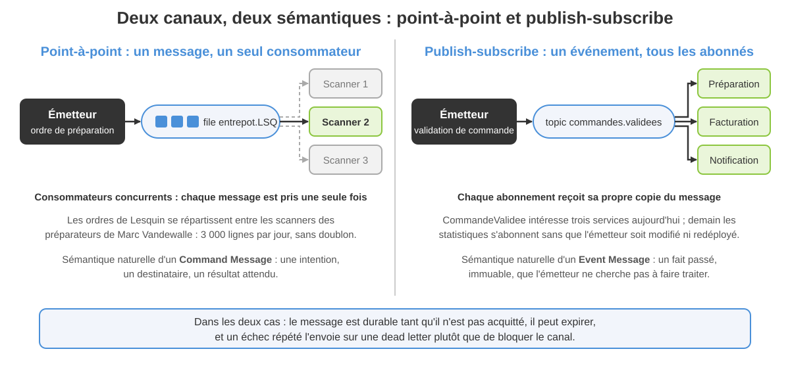
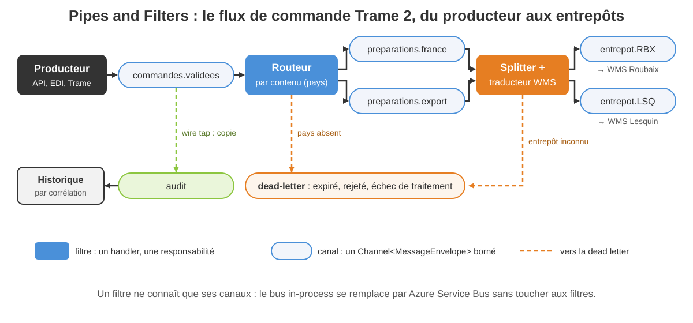
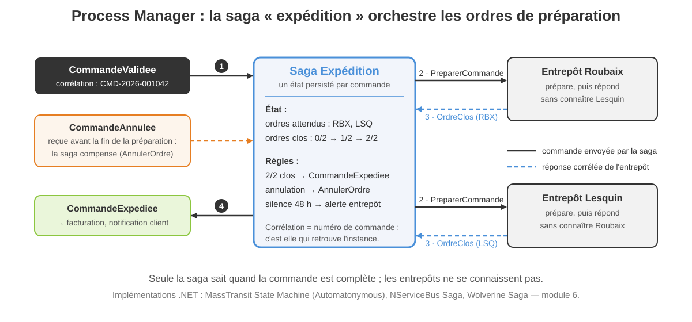
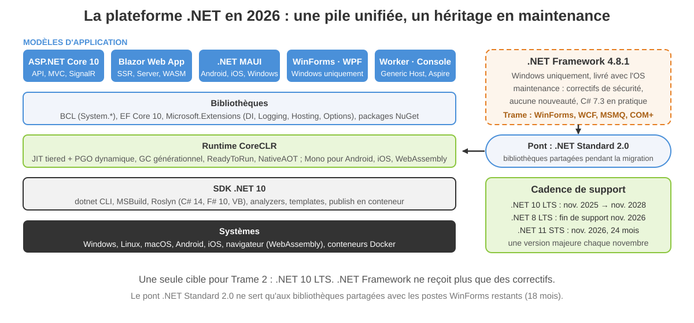
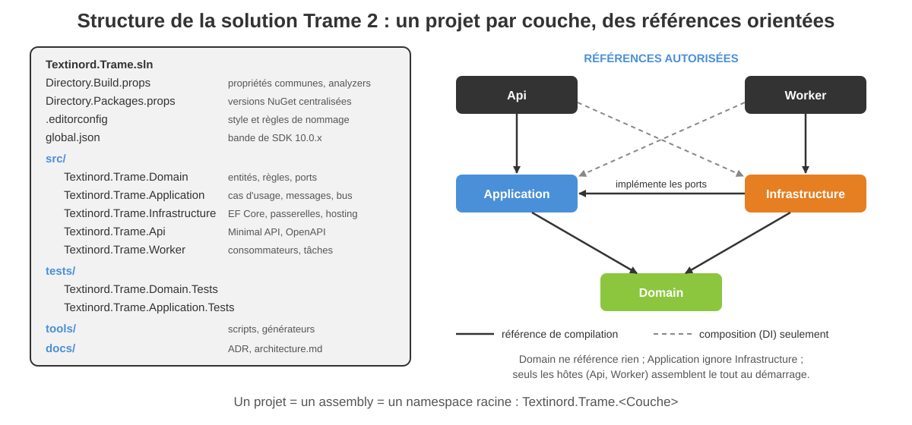

<!-- _class: lead -->

# Module 2

## Intégration par messages et plateforme .NET

Architectures d'entreprise avec les technologies Microsoft — Jour 1, après-midi — 3 h 30

---

<!-- _class: dense -->

## Objectifs du module

À la fin de cette demi-journée, vous serez capable de :

- **Choisir un style d'intégration** entre deux systèmes et justifier l'asynchrone
- **Nommer et appliquer les patterns d'intégration** de Hohpe et Woolf : canaux, construction, transformation, routage, gestion
- **Situer la plateforme .NET en 2026** : versions, runtime, assemblies, outillage
- **Structurer une solution** par couche, avec des règles de nommage appliquées à la compilation
- **Implémenter un bus in-process** sur `System.Threading.Channels`, testé

<div class="key">

Ce matin, le noyau métier de Trame 2. Cet après-midi : comment ce noyau **parle aux entrepôts** sans se coupler à eux, et sur **quelle plateforme** il tourne.

</div>

---

<!-- _class: tight -->

## Plan de la demi-journée

1. Styles d'intégration et canaux de messages
2. Construire et transformer un message
3. Router et gérer le système de messages
4. La plateforme .NET en 2026
5. Structurer et nommer une solution Trame 2

Fil rouge : les **ordres de préparation** de Textinord. Aujourd'hui, MSMQ perd des messages au redémarrage des serveurs et Marc Vandewalle, à Lesquin, ne sait jamais si une commande est complète. Ce module construit le pipeline qui remplace MSMQ ; le module 6 le branchera sur Azure Service Bus.

Démo 2.1 et exercice 2.1 ferment la section 3 ; exercice 2.2 et TP 2 ferment la section 5.

---

<!-- _class: lead -->

# 1. Styles d'intégration et canaux de messages

---

<!-- _class: dense -->

## Quatre styles d'intégration (Hohpe et Woolf)

| Style | Chez Textinord | Ce que ça coûte |
|---|---|---|
| **Transfert de fichiers** | EDI des 20 grands comptes : fichiers déposés la nuit | latence d'un jour, formats à valider, reprise manuelle |
| **Base de données partagée** | Trame : l'ADV et l'entrepôt lisent les mêmes tables | schéma figé, verrous, règles dupliquées en T-SQL |
| **Appel de procédure distante** | services WCF en `basicHttpBinding` | couplage temporel : l'entrepôt doit répondre tout de suite |
| **Messaging** | cible Trame 2 : événements et ordres sur un bus | asynchrone, infrastructure à exploiter, cohérence différée |

Aucun style n'est mauvais en soi : l'EDI restera en fichiers. Le messaging s'impose là où l'émetteur **ne doit pas attendre** le destinataire.

---

<!-- _class: tight -->

## Pourquoi l'asynchrone : le couplage temporel

- En RPC, l'appelant est **bloqué** tant que l'appelé n'a pas répondu : 900 commandes par jour en pointe, et l'ADV attend le WMS de Lesquin à chaque validation
- Si le WMS redémarre, la commande **échoue ou se perd** ; personne ne le voit avant l'appel du client
- Un message déposé sur un canal **survit** à l'indisponibilité du consommateur : il sera traité plus tard, dans l'ordre
- Émetteur et consommateur **évoluent séparément** : versions, langages, rythmes de déploiement
- Prix à payer : cohérence **à terme**, consommateurs idempotents, supervision des files

<div class="key">

Le messaging découple **dans le temps** (le destinataire peut être absent) et **dans l'espace** (l'émetteur ignore l'adresse du destinataire). RPC ne fait ni l'un ni l'autre.

</div>

---

<!-- _class: dense -->

## Message, canal, endpoint, broker : le vocabulaire

- **Message** : une enveloppe (en-têtes : identifiant, corrélation, date, expiration) et un corps (les données métier sérialisées)
- **Canal** : le tuyau nommé sur lequel on dépose et on lit ; il a une capacité, une durabilité, une sémantique (file ou topic)
- **Endpoint** : le code, côté application, qui parle au canal — producteur ou consommateur ; il sérialise, acquitte, réessaie
- **Broker** : le serveur qui héberge les canaux (RabbitMQ, Azure Service Bus) ; en développement, `System.Threading.Channels` joue ce rôle en mémoire
- **Pipes and Filters** : le style qui enchaîne des traitements indépendants (filtres) reliés par des canaux (tuyaux)

Un filtre ne connaît que ses canaux d'entrée et de sortie : on le teste seul, on le remplace, on le déplace.

---

<!-- _class: visual -->

## Point-à-point ou publish-subscribe



---

<!-- _class: tight -->

## Canaux spécialisés

| Pattern | Rôle | Trame 2 |
|---|---|---|
| **Datatype Channel** | un canal par type de message | `commandes.validees` ne transporte que `CommandeValidee` |
| **Invalid Message Channel** | messages qui ne respectent pas le contrat | pays absent, JSON illisible |
| **Dead Letter Channel** | messages non livrables : expirés, échecs répétés | `dead-letter`, lu par la supervision |
| **Guaranteed Delivery** | persistance côté broker jusqu'à l'acquittement | Service Bus ; MSMQ le perdait au redémarrage |
| **Channel Adapter** | branche un système non messager sur un canal | l'endpoint HTTP `POST /messages/commandes-validees` |
| **Message Bridge** | relie deux systèmes de messagerie | RabbitMQ local vers Service Bus en transition |
| **Message Bus** | l'ensemble : canaux, format canonique, routage | `IMessageBus` de Trame 2 |

---

<!-- _class: lead -->

# 2. Construire et transformer un message

---

<!-- _class: dense -->

## Command, document, event : trois intentions

```csharp
// Command Message : une intention, un seul destinataire, peut échouer
public sealed record ValiderCommande(string Numero);

// Document Message : des données, sans dire quoi en faire
public sealed record OrdrePreparationEntrepot(
    string NumeroOrdre, string Site, string TypeFlux,
    IReadOnlyList<LignePreparation> Lignes);

// Event Message : un fait passé, immuable, pour qui veut l'entendre
public sealed record CommandeValidee(
    string Numero, string ClientCode, string? PaysLivraison,
    bool Urgente, IReadOnlyList<LigneValidee> Lignes);
```

Impératif pour la commande, participe passé pour l'événement, nom pour le document : le nom du type dit déjà la sémantique du canal.

---

<!-- _class: dense -->

## Les en-têtes qui font vivre le message

| Pattern | En-tête | Usage Textinord |
|---|---|---|
| **Request-Reply** | deux canaux, un aller et un retour | consultation de stock par message |
| **Return Address** | `AdresseRetour` | l'entrepôt sait où répondre sans configuration |
| **Correlation Identifier** | `CorrelationId`, `CausationId` | retrouver toute l'histoire d'une commande |
| **Message Sequence** | `NumeroSequence`, `TailleSequence` | ordres 1/2 et 2/2 : la commande est complète |
| **Message Expiration** | `ExpireLe` | un ordre de plus de 4 h n'a plus de sens |
| **Format Indicator** | `Type = "CommandeValidee.v1"` | faire coexister v1 et v2 pendant 18 mois |

Le `MessageId` est un `Guid.CreateVersion7()` : unique et **ordonné dans le temps**, ce qui simplifie l'idempotence et les index.

---

<!-- _class: tight -->

## Transformer un message

| Pattern | Ce qu'il fait | Exemple Trame 2 |
|---|---|---|
| **Message Translator** | convertit d'un format vers un autre | `CommandeValidee` vers le format WMS : codes courts, majuscules |
| **Envelope Wrapper** | ajoute et retire les en-têtes de transport | `MessageEnvelope` autour du corps métier |
| **Content Enricher** | complète avec des données externes | ajouter l'adresse de livraison depuis le référentiel client |
| **Content Filter** | retire ce que le destinataire ne doit pas voir | prix et remises absents de l'ordre d'entrepôt |
| **Claim Check** | stocke le gros contenu à part, transmet une clé | PDF dans Azure Blob, clé dans le message |
| **Normalizer** | un routeur et un traducteur par format d'entrée | EDI des grands comptes : trois formats vers un seul |
| **Canonical Data Model** | un format pivot partagé par tous | `CommandeValidee` : ni Trame, ni WMS |

---

<!-- _class: dense -->

## Démo 2.1 — Pipeline de messages en mémoire

- Console .NET 10 sans package : quatre `Channel<T>`, un routeur par contenu (France ou export), un traducteur vers le format WMS, une dead letter
- Quatre commandes en entrée dont deux mal formées : on suit chaque message jusqu'à son canal final, corrélation à l'appui
- Puis tour de la solution `Textinord.Trame` : `dotnet sln list`, `Directory.Build.props`, `Directory.Packages.props`, analyzers
- À retenir : chaque filtre est une fonction testable, le bus n'est qu'un détail d'infrastructure

Document : `demos/module-02/demo-2-1-pipeline-messages-channels.md`

---

<!-- _class: lead -->

# 3. Router et gérer le système de messages

---

<!-- _class: visual -->

## Le flux de commande en Pipes and Filters



---

<!-- _class: tight -->

## Routage : neuf patterns

| Pattern | Décision | Exemple Textinord |
|---|---|---|
| **Content-Based Router** | selon le contenu | pays FR vers le flux national, sinon export |
| **Message Filter** | garder ou jeter | ignorer les commandes déjà expédiées |
| **Dynamic Router** | règles mises à jour par les destinataires | un entrepôt s'annonce disponible |
| **Recipient List** | liste de destinataires calculée | notifier client, commercial, comptabilité |
| **Splitter** | un message devient n messages | une commande, un ordre par entrepôt |
| **Aggregator** | n messages deviennent un | deux ordres clos, une commande expédiée |
| **Resequencer** | remettre dans l'ordre | mouvements de stock arrivés dans le désordre |
| **Scatter-Gather** | diffuser, puis agréger les réponses | demander le stock aux deux entrepôts, garder le meilleur |
| **Routing Slip** | l'itinéraire voyage avec le message | contrôle crédit, douane, entrepôt : selon le client |

---

<!-- _class: visual -->

## Process Manager : la saga expédition



---

<!-- _class: tight -->

## Gérer le système de messages

| Pattern | Ce qu'il permet | Trame 2 |
|---|---|---|
| **Control Bus** | piloter les endpoints par messages | mettre un consommateur en pause pendant l'inventaire |
| **Detour** | dérouter vers une étape optionnelle | validation manuelle au-delà de 50 000 € |
| **Wire Tap** | copier sans perturber | canal `audit` alimenté depuis `commandes.validees` |
| **Message History** | liste des étapes traversées | `CausationId` chaîné, exposé par `/audit/{correlation}` |
| **Message Store** | conserver une copie consultable | `HistoriqueMessages` en mémoire, table SQL au module 4 |
| **Smart Proxy** | suivre les request-reply | mesurer le temps de réponse du WMS |
| **Test Message** | messages de sonde | commande `CMD-0000-000000` chaque matin à 6 h |

---

<!-- _class: tight -->

## Outillage .NET pour le messaging

| Bibliothèque | Nature | Quand |
|---|---|---|
| `System.Threading.Channels` | producteur / consommateur en mémoire, dans la BCL | pipeline intra-processus, tests, `BackgroundService` |
| **MassTransit** | bus applicatif : sagas, outbox, retry, transports | choix Trame 2 : RabbitMQ en local, Service Bus en production |
| **Wolverine** | bus et médiateur, génération de code, Marten | une équipe qui veut un seul framework pour handlers et messages |
| **NServiceBus** | bus commercial, outillage de supervision | grands comptes, support éditeur exigé |
| `Azure.Messaging.ServiceBus` | SDK bas niveau Azure | quand on ne veut aucune abstraction |
| `RabbitMQ.Client` | SDK bas niveau AMQP | idem, on-premise |
| **Dapr** | sidecar pub/sub multi-langage | plateforme polyglotte sur Kubernetes |

---

<!-- _class: tight -->

## `System.Threading.Channels` en douze lignes

```csharp
var options = new BoundedChannelOptions(1_000)
    { FullMode = BoundedChannelFullMode.Wait, SingleReader = true };
var canal = Channel.CreateBounded<CommandeValidee>(options);

// Producteur : attend si le canal est plein, ne perd jamais
await canal.Writer.WriteAsync(commande, ct);
canal.Writer.Complete();               // plus rien n'entrera

// Consommateur : boucle asynchrone jusqu'à la fermeture du canal
await foreach (var message in canal.Reader.ReadAllAsync(ct))
{
    await TraiterAsync(message, ct);
}
```

Borné plutôt qu'illimité : la **contre-pression** protège la mémoire quand l'entrepôt ralentit. `SingleReader` optimise le cas d'une seule boucle de lecture.

---

<!-- _class: dense -->

## Exercice 2.1 — Choisir le pattern EIP

- Six situations Textinord : EDI des grands comptes, notification client, ordre multi-entrepôt, accusés des entrepôts, commandes urgentes, audit réglementaire
- Pour chacune : le pattern principal, le type de canal, une phrase de justification
- Travail individuel 15 minutes, puis confrontation en binôme : il y a souvent deux réponses défendables
- Bonus : dessiner le pipeline complet des six situations

Document : `exercices/module-02/exercice-2-1-choisir-le-pattern-eip.md`

---

<!-- _class: lead -->

# 4. La plateforme .NET en 2026

---

<!-- _class: visual -->

## Une pile unifiée, un héritage en maintenance



---

<!-- _class: tight -->

## La grille des technologies

| Version | Statut en septembre 2026 | Usage chez Textinord |
|---|---|---|
| **.NET 10** (LTS, nov. 2025) | supporté jusqu'en nov. 2028 ; C# 14 | **cible unique** de Trame 2 |
| **.NET 8** (LTS, nov. 2023) | fin de support nov. 2026 : à migrer | quelques outils internes, montée en .NET 10 avant la fin d'année |
| **.NET 9** (STS, nov. 2024) | fin de support nov. 2026, comme .NET 8 | aucun |
| **.NET Framework 4.8.1** | maintenance : sécurité seulement, lié à Windows | Trame ; les postes WinForms restants pendant 18 mois |
| **.NET Standard 2.0** | spécification d'API, plus de nouvelle version | bibliothèques partagées entre Trame et Trame 2 |

<div class="warn">

Nadia Benali le sait : « supporté » pour .NET Framework signifie **aucune fonctionnalité nouvelle**. Chaque ligne écrite pour Trame aujourd'hui est une ligne à migrer demain.

</div>

---

<!-- _class: tight -->

## .NET Framework vs .NET : ce qui n'existe plus

| Dans Trame (.NET Framework 4.8) | Dans Trame 2 (.NET 10) |
|---|---|
| ASP.NET Web Forms | ASP.NET Core : Razor Pages, MVC, Blazor |
| WCF serveur, SOAP | Minimal APIs et OpenAPI, gRPC ; CoreWCF seulement pour migrer |
| MSMQ | RabbitMQ, Azure Service Bus (module 6) |
| COM+ et DTC, transactions distribuées | `TransactionScope` local, Outbox, sagas |
| .NET Remoting, AppDomains | gRPC ; `AssemblyLoadContext` pour l'isolation |
| `BinaryFormatter` | `System.Text.Json`, Protobuf |
| GAC, strong naming | NuGet, SemVer |
| Linq to SQL, WIF | EF Core 10, ASP.NET Core Authentication et Entra ID |

Ce qui reste : le langage, la BCL, WinForms et WPF sur Windows. `.NET Upgrade Assistant` et les analyseurs de compatibilité font l'inventaire ; la stratégie de migration est au module 6.

---

<!-- _class: tight -->

## Le CLR et ses services

- **Chargement** : l'assembly est lu, ses métadonnées vérifiées, ses types résolus à la demande ; plus d'AppDomain, un `AssemblyLoadContext` par besoin d'isolation
- **JIT tiered** : compilation rapide au premier appel, recompilation optimisée des méthodes chaudes, guidée par le **PGO dynamique**
- **GC** générationnel et concurrent, modes serveur ou station de travail ; `Span<T>`, pooling et `struct` pour réduire la pression
- **ReadyToRun** : IL précompilé pour démarrer vite ; **NativeAOT** : binaire natif sans JIT, pour les conteneurs et les outils en ligne de commande
- **Interopérabilité** : P/Invoke, `LibraryImport`, COM sur Windows (module 5)

<div class="key">

**Transactions** : `System.Transactions` fonctionne en local, sur une seule ressource ; le DTC n'existe que sur Windows et n'a plus sa place. **Message queuing** : rien dans le runtime, tout en bibliothèques. MSMQ et COM+ : au module 6.

</div>

---

<!-- _class: tight -->

## Langages, CTS et assemblies

- **CTS** (Common Type System) : le modèle de types commun — valeur ou référence, héritage, interfaces, génériques ; **CLS** : le sous-ensemble que tout langage sait consommer, vérifié par `[CLSCompliant]`
- **Langages** : C# 14 (records, pattern matching, `field`, membres d'extension), F# 10, VB.NET en maintenance ; tous compilent en **IL** et métadonnées
- **Assembly** : l'unité de déploiement et de version — manifeste (nom, version, culture, références), IL, métadonnées, ressources ; un `.dll` ou un `.exe`
- **Versioning** : `AssemblyVersion` pour la liaison, `FileVersion`, `InformationalVersion` en SemVer ; NuGet remplace le GAC et le strong naming
- **Trimming** et publication en un seul fichier : `dotnet publish -p:PublishTrimmed=true` retire ce qui n'est pas atteint ; NativeAOT va plus loin
- **Réflexion ou source generators** : lire les métadonnées à l'exécution, ou générer le code à la compilation (`LoggerMessage`, `GeneratedRegex`, `System.Text.Json`)

---

<!-- _class: lead -->

# 5. Structurer et nommer une solution Trame 2

---

<!-- _class: tight -->

## Outillage 2026 et conception dans Visual Studio

| Outil | Pour quoi | Remarque |
|---|---|---|
| **Visual Studio 2026** (2022 maintenu) | IDE complet, designers WinForms et WPF, profilage, Live Unit Testing | Community pour les indépendants, Professional en entreprise |
| **VS Code et C# Dev Kit** | édition légère, multiplateforme | Sofia Marques l'impose pour les revues sur Linux |
| **dotnet CLI** | `new`, `build`, `test`, `publish`, `sln`, `format` | la référence : ce que fait la CI |
| **Roslyn analyzers** | règles de qualité et de style à la compilation | `AnalysisLevel`, `EnforceCodeStyleInBuild` |
| **Diagrammes de dépendances** | valider les références entre couches | édition Enterprise ; alternative : `ArchUnitNET` en test |
| **Code Map** | visualiser les appels autour d'une classe | comprendre `CommandeManager` avant de le découper |

---

<!-- _class: tight -->

## `Directory.Build.props` et Central Package Management

```xml
<!-- Directory.Build.props : hérité par tous les projets -->
<Project>
  <PropertyGroup>
    <TargetFramework>net10.0</TargetFramework>
    <Nullable>enable</Nullable>
    <TreatWarningsAsErrors>true</TreatWarningsAsErrors>
    <AnalysisLevel>latest-recommended</AnalysisLevel>
    <EnforceCodeStyleInBuild>true</EnforceCodeStyleInBuild>
  </PropertyGroup>
</Project>
<!-- Directory.Packages.props : une seule version par package -->
<PackageVersion Include="xunit" Version="2.9.3" />
```

Un `.csproj` ne contient plus que ses références ; `.editorconfig` porte le style et les règles de nommage ; `global.json` fixe la bande de SDK.

---

<!-- _class: visual -->

## Un projet par couche, des références orientées



---

<!-- _class: tight -->

## Règles de nommage

| Élément | Règle | Exemple |
|---|---|---|
| Assembly = namespace racine | `Societe.Produit.Couche`, PascalCase | `Textinord.Trame.Application` |
| Namespace | suit l'arborescence des dossiers | `Textinord.Trame.Application.Commandes.Routage` |
| Type, méthode, propriété | PascalCase, sans abréviation | `OrdrePreparationTranslator`, `Traduire` |
| Interface | préfixe `I` | `IMessageBus`, `IEntrepotGateway` |
| Méthode asynchrone | suffixe `Async` | `PublierAsync`, `TransmettreAsync` |
| Champ privé, paramètre | `_camelCase`, `camelCase` ; jamais de notation hongroise | `_deadLetters`, `cancellationToken` |
| Projet de tests | `<Projet>.Tests`, classe `<Type>Tests` | `Textinord.Trame.Application.Tests` |

Ces règles vivent dans `.editorconfig` en sévérité `warning` : avec `TreatWarningsAsErrors`, un `iMessageBus` ne compile pas.

---

<!-- _class: dense -->

## Exercice 2.2 — Nommage et structure

- Une solution Trame 2 « telle que livrée par un prestataire » : noms d'assemblies, namespaces, classes, méthodes async et dossiers à corriger
- Vous appliquez les règles de la slide précédente et vous justifiez chaque correction en une ligne
- Puis vous écrivez la règle `.editorconfig` qui aurait empêché la faute la plus fréquente
- 20 minutes, correction collective au tableau

Document : `exercices/module-02/exercice-2-2-nommage-et-structure.md`

---

<!-- _class: dense -->

## TP 2 — Squelette de Trame 2 et bus interne

- Créer la solution complète : `Domain`, `Application`, `Infrastructure`, `Api`, `Worker`, deux projets de tests ; `Directory.Build.props`, `Directory.Packages.props`, `.editorconfig`, analyzers activés
- Implémenter dans `Application` le bus in-process sur `Channel<T>` : routeur par contenu, traducteur vers le format WMS, dead letter, corrélation propagée
- Tests xUnit : au moins huit, dont un de bout en bout
- 75 minutes, en binôme ; point de contrôle toutes les 20 minutes

Document : `tp/module-02/tp-2-squelette-trame2-et-bus-interne.md`

---

<!-- _class: dense -->

## Récapitulatif du module

- Quatre styles d'intégration ; le messaging découple **dans le temps et dans l'espace**, au prix d'une cohérence différée
- Un message = enveloppe + corps ; **command, document, event** ; les en-têtes (corrélation, séquence, expiration, format) font le travail
- Canaux **point-à-point** pour les commandes, **publish-subscribe** pour les événements ; dead letter et invalid message toujours prévus
- Transformation par **traducteur** vers un modèle canonique ; routage par **contenu**, splitter et aggregator, **saga** pour orchestrer
- **.NET 10 LTS** est la seule cible ; .NET Framework est en maintenance ; le CLR n'embarque ni DTC ni message queuing
- Une solution = un projet par couche, `Directory.Build.props`, CPM, `.editorconfig` avec des règles de nommage **compilées**

---

<!-- _class: quiz -->

## Quiz — 1/5

**Q1.** Le messaging découple l'émetteur et le destinataire…

- a) dans le temps et dans l'espace
- b) dans l'espace seulement
- c) ni l'un ni l'autre, comme le RPC

**Q2.** Un ordre de préparation destiné à un seul préparateur circule naturellement sur…

- a) un canal publish-subscribe
- b) un canal point-à-point
- c) un control bus

---

<!-- _class: quiz -->

## Quiz — 2/5

**Q3.** Quel en-tête permet de retrouver tous les messages issus d'une même commande ?

- a) `MessageId`
- b) `ExpireLe`
- c) `CorrelationId`

**Q4.** Le pattern qui convertit `CommandeValidee` vers le format du WMS est…

- a) Message Translator
- b) Content Enricher
- c) Claim Check

---

<!-- _class: quiz -->

## Quiz — 3/5

**Q5.** Une commande sur deux entrepôts qui devient deux ordres de préparation, c'est…

- a) un Aggregator
- b) un Resequencer
- c) un Splitter

**Q6.** Le Wire Tap…

- a) copie le message vers un autre canal sans perturber le flux
- b) modifie le message pour y ajouter une trace d'audit
- c) bloque le flux le temps de l'audit

---

<!-- _class: quiz -->

## Quiz — 4/5

**Q7.** En septembre 2026, .NET Framework 4.8.1 est…

- a) la cible recommandée pour les applications Windows
- b) supprimé de Windows
- c) en maintenance : correctifs de sécurité uniquement

**Q8.** Dans .NET 10, le message queuing est…

- a) intégré au runtime
- b) fourni par des bibliothèques (MassTransit, SDK Service Bus)
- c) assuré par MSMQ

---

<!-- _class: quiz -->

## Quiz — 5/5

**Q9.** `Directory.Packages.props` sert à…

- a) définir les propriétés MSBuild communes
- b) lister les projets de la solution
- c) centraliser les versions des packages NuGet

**Q10.** Quelle combinaison respecte les conventions .NET ?

- a) `interface IMessageBus`, méthode `PublierAsync`
- b) `interface MessageBus`, méthode `Publier` marquée `async`
- c) `interface IMessageBus`, champ privé `m_bus`

Réponses commentées : lors de la correction en séance.

---

<!-- _class: lead -->

# Prochaine étape

## Module 3 — Applications web et clients : ASP.NET Core, Blazor, SPA, MAUI

Le bus existe, la solution est structurée. Demain matin : **ce que voient les utilisateurs** — l'extranet Blazor de Textinord et l'application scanner .NET MAUI de Marc Vandewalle, branchés sur l'API de Trame 2.
