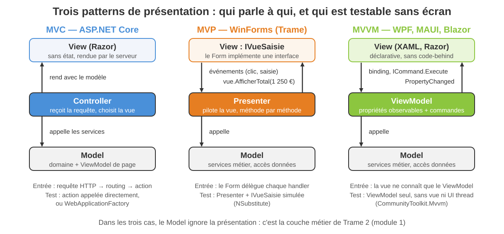
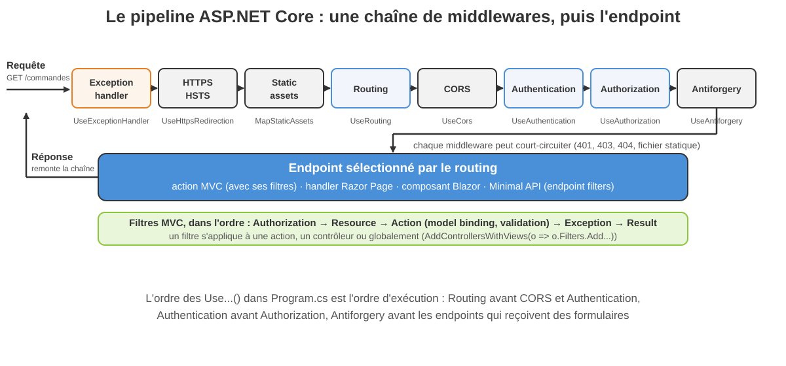
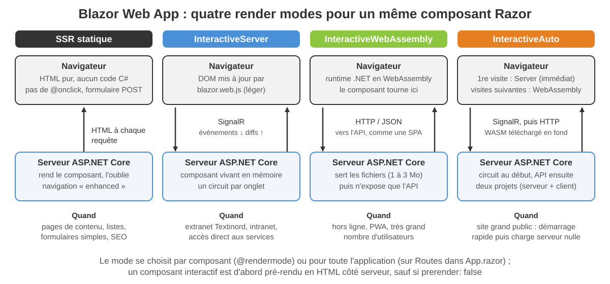
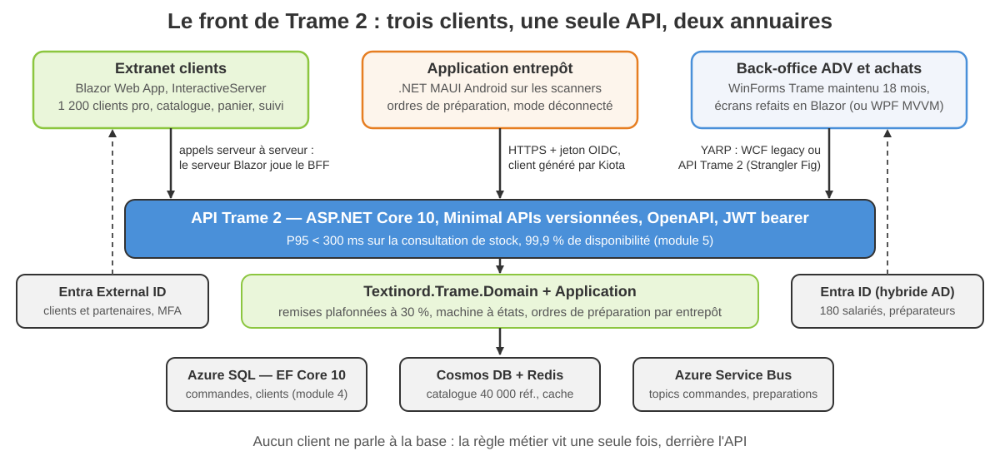

<!-- _class: lead -->

# Module 3

## Applications web et clients : ASP.NET Core, Blazor, SPA, MAUI

Architectures d'entreprise avec les technologies Microsoft<br>Jour 2, matin — 3 h 30

---

<!-- _class: tight -->

## Objectifs du module

À la fin de ce module, vous serez capable de :

- **Situer** les technologies de présentation .NET en 2026 et écarter celles en fin de vie
- **Choisir** une technologie front pour un besoin donné avec une grille de critères, et l'écrire dans un ADR
- **Appliquer** MVC, MVP, MVVM et Dashboard à la technologie qui leur convient
- **Construire** une Blazor Web App : composants, render modes, formulaires validés, service injecté, tests bUnit
- **Extraire** un ViewModel testable d'un code-behind WinForms avec CommunityToolkit.Mvvm

<div class="key">

Le module 1 a isolé le noyau métier de Trame 2, le module 2 a structuré la solution et le bus. Ce matin, Textinord reçoit ses écrans : l'extranet clients, l'application des préparateurs et l'avenir des postes WinForms.

</div>

---

<!-- _class: tight -->

## Plan de la demi-journée

1. Panorama de la présentation .NET en 2026
2. Patterns de présentation : MVC, MVP, MVVM, Dashboard
3. ASP.NET Core MVC et Razor Pages
4. SPA avec Angular et TypeScript
5. Blazor : render modes, composants, formulaires, création pas à pas
6. Clients Windows et multiplateforme : WinForms, WPF, .NET MAUI

Fil rouge : Textinord doit remplacer trois écrans. Le site marchand **Web Forms** (refonte inévitable), l'application **WinForms** de l'ADV (180 000 lignes de code-behind) et l'absence d'application pour les préparateurs de Lesquin. La démo 3.1 et le TP 3 construisent l'**extranet Blazor** ; l'exercice 3.2 prépare la migration des écrans WinForms.

---

<!-- _class: lead -->

# 1. Panorama de la présentation .NET en 2026

---

<!-- _class: tight -->

## Trame aujourd'hui : ce qui n'a pas d'avenir

| Brique Trame | État en 2026 | Chemin de migration |
|---|---|---|
| Site B2C ASP.NET Web Forms | absent de .NET, aucun portage | refonte : Blazor Web App, ou MVC / Razor Pages |
| WinForms .NET Framework 4.8 | WinForms est maintenu sur .NET 10 (Windows) | migrer le projet (Upgrade Assistant), isoler la logique en ViewModels |
| Silverlight | fin de vie depuis 2021 | Blazor WebAssembly |
| Xamarin.Forms | fin de support en mai 2024 | .NET MAUI (Upgrade Assistant) |
| UWP | maintenance, plus d'évolution | WinUI 3 (Windows App SDK) ou .NET MAUI |

<div class="warn">

Aucune de ces briques ne reçoit de nouveau développement. Le WinForms de l'ADV reste en production 18 mois : on le migre vers .NET 10 pour gagner du temps et partager du code, on ne le réécrit pas d'un coup.

</div>

---

<!-- _class: packed -->

## La grille des technologies et leurs critères de choix

| Technologie | Rendu | Elle convient quand | Elle gêne quand |
|---|---|---|---|
| ASP.NET Core MVC / Razor Pages | HTML côté serveur | contenu, SEO, formulaires, équipe .NET | interactivité riche, hors ligne |
| Blazor Web App (SSR + Server) | HTML puis SignalR | intranet, extranet, équipe C# sans JavaScript | réseau instable, très grand public |
| Blazor WebAssembly / Auto | .NET dans le navigateur | PWA, hors ligne, charge serveur nulle | premier chargement (1 à 3 Mo), SEO |
| SPA Angular + API | TypeScript dans le navigateur | équipe front dédiée, écosystème JS, plusieurs back-ends | deux pipelines, deux compétences |
| WinForms sur .NET 10 | Windows natif | maintenance de l'existant, outils internes rapides | multiplateforme, ergonomie moderne |
| WPF sur .NET 10 | Windows natif, XAML | postes métier riches, MVVM, graphiques | multiplateforme, web |
| .NET MAUI | natif Android, iOS, Windows, macOS | terrain, scanners, hors ligne, capteurs | web pur, équipe sans mobile |
| WinUI 3 | Windows natif moderne | applications Windows 11 « Fluent » | Windows uniquement |

---

<!-- _class: lead -->

# 2. Patterns de présentation : MVC, MVP, MVVM, Dashboard

---

<!-- _class: visual -->

## Trois patterns, une question : qui parle à qui ?



---

<!-- _class: tight -->

## Les trois patterns en pratique

| | MVC | MVP | MVVM |
|---|---|---|---|
| Qui pilote | le Controller, à chaque requête | le Presenter, via une interface de vue | le binding : la vue observe le ViewModel |
| Où vit l'état | nulle part (stateless) | dans le Form, exposé par `IVue` | dans le ViewModel (`INotifyPropertyChanged`) |
| Testabilité | action seule ou `WebApplicationFactory` | Presenter avec une `IVue` simulée | ViewModel seul, sans UI ni thread graphique |
| Technologies .NET | ASP.NET Core MVC, Razor Pages | WinForms (Trame) | WPF, MAUI, WinUI 3, Blazor |
| Piège classique | contrôleurs obèses | Presenter qui refait la vue | logique cachée dans les convertisseurs |

<div class="key">

Blazor est un cas particulier : le composant Razor réunit vue et ViewModel. Un bloc `@code` qui grossit se déplace vers une classe ViewModel ou un service, exactement comme un code-behind WinForms.

</div>

---

<!-- _class: dense -->

## Dashboard, ViewModel ou DTO, BFF

- **Dashboard / composite UI** : un écran assemble des blocs indépendants (stock, commandes du jour, alertes), chacun avec son chargement et sa source. En Blazor, un composant par bloc ; en WPF, un `UserControl` et son ViewModel par bloc, un `MainViewModel` qui les compose
- **ViewModel de page ≠ DTO d'API** : le DTO est le contrat de l'API, stable et versionné (module 5) ; le ViewModel est taillé pour un écran (libellés, formats, états). On ne renvoie jamais une entité EF Core à une vue
- **BFF (Backend for Frontend)** : une façade par type de client, qui agrège les appels et porte l'authentification (cookie côté navigateur, jeton côté serveur). Le serveur Blazor joue ce rôle nativement ; une SPA Angular doit s'en donner un

<div class="warn">

Le tableau de bord de Nadia Benali (DSI) n'est pas « une page de plus » : chaque tuile est un composant réutilisable, avec sa source et son test bUnit.

</div>

---

<!-- _class: dense -->

## Exercice 3.1 — Choisir la technologie front

- Cinq besoins Textinord : extranet clients, scanner entrepôt, back-office ADV, tableau de bord direction, borne showroom
- Une grille de sept critères (public, réseau, périphériques, compétences, déploiement, hors ligne, durée de vie) à remplir, puis à pondérer
- Une décision par besoin, justifiée en trois lignes, avec le pattern de présentation associé ; en bonus, l'ADR de l'extranet
- 25 minutes en binôme ; restitution : deux binômes défendent un choix contesté

Document : `exercices/module-03/exercice-3-1-choisir-la-techno-front.md`

---

<!-- _class: lead -->

# 3. ASP.NET Core MVC et Razor Pages

---

<!-- _class: visual -->

## Middlewares en chaîne, puis l'endpoint



---

<!-- _class: tight -->

## Contrôleur, routing, model binding, Razor Pages

```csharp
[Route("commandes")]
public sealed class CommandesController(ICommandeService service) : Controller
{
    [HttpGet("{numero}")]                  // GET /commandes/CMD-2026-000042
    public async Task<IActionResult> Details(string numero, CancellationToken ct)
    {
        var commande = await service.TrouverAsync(numero, ct);
        return commande is null ? NotFound() : View(CommandeVm.Depuis(commande));
    }
}
```

- **Routing** par attributs (`[Route]`, `[HttpGet("{numero}")]`) ou conventionnel (`{controller=Home}/{action=Index}/{id?}`) ; les contraintes (`{id:int}`) filtrent avant l'action
- **Model binding** : route, query string, formulaire, corps JSON (`[FromBody]`) deviennent des paramètres typés ; une classe ViewModel ou un `record` suffit
- **Razor Pages** : le Page Controller du module 1 — `@page` + `PageModel` avec `OnGetAsync` / `OnPostAsync` ; même pipeline, mêmes tag helpers, idéal pour « une page, un formulaire »

---

<!-- _class: tight -->

## Validation, filtres, antiforgery et briques Razor

```csharp
[HttpPost, ValidateAntiForgeryToken]
public async Task<IActionResult> Creer(CreerCommandeVm vm, CancellationToken ct)
{
    if (!ModelState.IsValid) return View(vm);      // DataAnnotations -> erreurs
    var numero = await service.CreerAsync(vm.VersCommande(), ct);
    return RedirectToAction(nameof(Details), new { numero });   // Post-Redirect-Get
}
```

- **Validation** : `DataAnnotations` sur le ViewModel (`[Required]`, `[Range(1, 10_000)]`), `IValidatableObject` pour les règles croisées, FluentValidation si les règles grossissent
- **Filtres** : `[Authorize]`, `[ServiceFilter<AuditFilter>]`, `IAsyncActionFilter` pour journaliser ou mesurer ; globaux via `options.Filters.Add(...)`
- **Antiforgery** : jeton émis par le tag helper `<form>`, vérifié par `[ValidateAntiForgeryToken]` ou `AutoValidateAntiforgeryToken` global
- **Tag helpers** (`<input asp-for="Quantite" />`), **view components** (`<vc:panier-resume />`), **areas** (`/Adv/Commandes`) : le HTML reste du HTML, la logique reste en C#

---

<!-- _class: lead -->

# 4. SPA avec Angular et TypeScript

---

<!-- _class: dense -->

## Quand choisir une SPA, et comment l'architecturer

- **Quand** : équipe front dédiée (TypeScript, RxJS, Jasmine, Playwright), interface très interactive, plusieurs back-ends, design system imposé par le groupe
- **Quand éviter** : équipe 100 % C# de six personnes (celle de Sofia Marques), écran interne, délai court — Blazor couvre le besoin avec une seule compétence
- **Architecture** : projet Angular (`ng new`) séparé de l'API ; en développement, `proxy.conf.json` redirige `/api` vers `https://localhost:7043` ; en production, même origine derrière YARP ou Front Door, sinon CORS explicite
- **Contrat** : l'API expose OpenAPI ; le client TypeScript est généré, jamais écrit à la main

<div class="key">

`dotnet new angular` a disparu du SDK avec .NET 8 : Visual Studio propose « Angular and ASP.NET Core » (deux projets, `Microsoft.AspNetCore.SpaProxy`) ; en ligne de commande, deux dossiers, deux outils, un seul pipeline CI.

</div>

---

<!-- _class: tight -->

## Authentification, client généré, déploiement

```bash
# client TypeScript généré depuis le contrat OpenAPI de l'API Trame 2
kiota generate -l typescript -d https://localhost:7043/openapi/v1.json \
      -c TrameClient -n textinord.trame -o src/app/api
# alternative : nswag openapi2tsclient /input:openapi.json /output:trame.ts
```

- **CORS** côté API : `AddCors` avec une politique nommée (`WithOrigins("https://extranet.textinord.fr")`, `AllowCredentials()`), `app.UseCors("front")` après `UseRouting` ; jamais `AllowAnyOrigin` avec des cookies
- **Cookies + BFF** (même origine, `SameSite=Strict`, antiforgery) par défaut ; **jetons OIDC + PKCE** avec Entra External ID si l'API est partagée — gardés en mémoire, jamais dans `localStorage`
- **Déploiement** : `ng build` produit des fichiers statiques servis par l'API (`MapStaticAssets` + fallback `index.html`), par Azure Static Web Apps ou un CDN ; l'API part en Container Apps (module 5)

---

<!-- _class: lead -->

# 5. Blazor : le web en C#

---

<!-- _class: visual -->

## Modèles d'hébergement et render modes



---

<!-- _class: tight -->

## Choisir un render mode pour chaque page de l'extranet

| Page Textinord | Mode | Pourquoi |
|---|---|---|
| Accueil, CGV, fiches article | SSR statique | contenu, SEO, aucun événement C# |
| Catalogue avec filtre et pagination | InteractiveServer | filtre immédiat, accès direct à `ICatalogueService`, rien à télécharger |
| Panier | InteractiveServer | état par circuit (`PanierService` scoped), rien dans le navigateur |
| Formulaire de commande | SSR (`FormName`) ou interactif | SSR suffit pour un POST validé ; interactif pour la saisie assistée |
| Scanner web de secours en entrepôt | InteractiveWebAssembly | doit survivre à une coupure Wi-Fi |
| Site grand public (futur B2C) | InteractiveAuto | démarrage immédiat, puis charge serveur nulle |

<div class="key">

Le mode se déclare par composant (`@rendermode InteractiveServer`) ou globalement sur `<Routes>` dans `App.razor`. Le TP 3 prend l'interactivité globale (un circuit, un panier scoped) ; la démo montre le mode par page.

</div>

---

<!-- _class: tight -->

## Un composant : paramètres et EventCallback

```razor
<div class="card article-carte">
    <h5>@Article.Libelle</h5>
    <p>@Format.Prix(Article.PrixBase) · @Article.StockTotal en stock</p>
    <input type="number" min="1" @bind="quantite" />
    <button @onclick="Ajouter" disabled="@(Article.StockTotal == 0)">Ajouter</button>
</div>

@code {
    private int quantite = 1;
    [Parameter, EditorRequired] public Article Article { get; set; } = default!;
    [Parameter] public EventCallback<AjoutPanier> OnAjouter { get; set; }
    private Task Ajouter() => OnAjouter.InvokeAsync(new AjoutPanier(Article, quantite));
}
```

- Le parent écrit `<ArticleCarte Article="article" OnAjouter="AjouterAuPanier" />` ; `EventCallback` re-rend le parent après l'appel, contrairement à un `Action` ; `@key` sur les listes évite de recréer les composants

---

<!-- _class: tight -->

## Formulaires et validation

```razor
<EditForm Model="saisie" OnValidSubmit="ValiderAsync" FormName="commande">
    <DataAnnotationsValidator />
    <ValidationSummary />
    <InputText @bind-Value="saisie.ReferenceClient" />
    <ValidationMessage For="() => saisie.ReferenceClient" />
    <InputDate @bind-Value="saisie.DateLivraisonSouhaitee" />
    <InputCheckbox @bind-Value="saisie.AccepteCgv" /> J'accepte les CGV
    <button type="submit">Confirmer la commande</button>
</EditForm>
```

- Le modèle porte les `DataAnnotations` (`[Required]`, `[RegularExpression(@"^\d{5}$")]`) et, pour les règles croisées, `IValidatableObject` : « livraison au plus tôt à J+2 »
- En SSR, `FormName` + `[SupplyParameterFromForm]` reçoivent le POST ; en interactif, `OnValidSubmit` s'exécute sur le serveur sans rechargement de page
- .NET 10 valide aussi les objets imbriqués (`AddValidation()`, `[ValidatableType]`, expérimental) ; FluentValidation se branche par un composant validateur

---

<!-- _class: dense -->

## Cascading values, état, interop JavaScript, authentification

- **Cascading values** : `<CascadingValue>` descend une valeur à tout l'arbre, reçue par `[CascadingParameter]` : client courant, thème, `EditContext`, état d'authentification
- **État** : un service `AddScoped` vit le temps du circuit en InteractiveServer (le panier du TP 3) ; `[PersistentState]` (.NET 10) transporte l'état du pré-rendu vers l'interactif ; `ProtectedSessionStorage` côté navigateur ; au-delà d'un circuit, la base ou Redis
- **Interop JS** : `IJSRuntime.InvokeAsync<T>("module.fonction", args)` sur un module ES importé à la demande ; `[JSInvokable]` dans l'autre sens ; jamais pendant le pré-rendu, seulement depuis `OnAfterRenderAsync(firstRender)`
- **Authentification** : `AddCascadingAuthenticationState()`, `<AuthorizeView>` dans le balisage, `[Authorize]` sur une page ; OIDC avec Entra External ID pour les clients, Entra ID pour les salariés (module 5)

---

<!-- _class: tight -->

## Créer l'application pas à pas

```bash
dotnet new blazor -n Textinord.Extranet -int Server -o src/Textinord.Extranet
dotnet new xunit  -n Textinord.Extranet.Tests -o tests/Textinord.Extranet.Tests
dotnet add tests/Textinord.Extranet.Tests package bunit
dotnet add tests/Textinord.Extranet.Tests reference src/Textinord.Extranet
dotnet new sln -n Textinord.Extranet --format sln
dotnet run --project src/Textinord.Extranet      # puis dotnet test
```

- Options : `-int Server | WebAssembly | Auto | None`, `-ai` pour l'interactivité globale, `-au Individual` pour ASP.NET Core Identity, `-e` pour un projet vide
- Squelette : `Program.cs` (`AddRazorComponents().AddInteractiveServerComponents()`, `MapRazorComponents<App>()`), `Components/App.razor` (HTML racine), `Routes.razor` (routeur), `Layout/`, `Pages/`, `_Imports.razor`
- Un service par contrat (`ICatalogueService`) enregistré dans `Program.cs` et injecté par `@inject` ; les composants partagés dans `Components/Partages/`

---

<!-- _class: dense -->

## Démo 3.1 — Extranet Blazor : page catalogue

- `dotnet new blazor`, puis le composant `CatalogueArticles` en `@rendermode InteractiveServer` : liste, filtre validé par `EditForm`, pagination
- Un composant enfant `ArticleCarte` avec `[Parameter]` et `EventCallback`, un service `ICatalogueService` injecté, en mémoire (120 articles Textinord)
- Ce qu'on regarde : le pré-rendu HTML dans l'onglet réseau, le circuit SignalR, le re-rendu après un clic, le test bUnit qui passe
- 20 minutes ; le code complet est dans le document, avec le plan B sans réseau

Document : `demos/module-03/demo-3-1-extranet-blazor-catalogue.md`

---

<!-- _class: lead -->

# 6. Clients Windows et multiplateforme : WinForms, WPF, .NET MAUI

---

<!-- _class: dense -->

## WinForms sur .NET 10 : maintenir sans s'enfermer

- **Toujours vivant** : livré avec .NET 10 (Windows), designer dans Visual Studio 2026, DPI élevé, `Control.InvokeAsync`
- **Migrer Trame** : .NET Upgrade Assistant, projet SDK-style `net10.0-windows` avec `<UseWindowsForms>` ; procédures stockées et WCF restent derrière une façade le temps de la migration
- **Ce qui casse** : `System.Configuration`, client WCF (vers `System.ServiceModel.*` ou HTTP), `BinaryFormatter` supprimé, composants tiers 32 bits
- **Le vrai gain** : sortir la logique du code-behind vers des ViewModels partagés avec WPF ou MAUI (exercice 3.2) ; le Form devient une coquille liée par `DataBindings`

<div class="warn">

On ne migre pas 180 000 lignes pour changer de runtime : on migre parce que .NET Framework 4.8.1 ne recevra plus rien, et pour partager le code avec Trame 2.

</div>

---

<!-- _class: tight -->

## WPF : XAML, binding, commandes

```xml
<Window x:Class="Textinord.Saisie.Wpf.SaisieCommandeWindow"
        xmlns:vm="clr-namespace:Textinord.Saisie.ViewModels;assembly=Textinord.Saisie.ViewModels">
  <StackPanel Margin="12">
    <TextBox Text="{Binding CodeClient, UpdateSourceTrigger=PropertyChanged}" />
    <Button Content="Rechercher" Command="{Binding RechercherClientCommand}" />
    <TextBlock Text="{Binding RaisonSociale}" FontWeight="Bold" />
    <ComboBox ItemsSource="{Binding Articles}" SelectedItem="{Binding ArticleSelectionne}" />
    <DataGrid ItemsSource="{Binding Lignes}" AutoGenerateColumns="True" IsReadOnly="True" />
    <TextBlock Text="{Binding Total, StringFormat={}{0:C}}" />
    <Button Content="Valider" Command="{Binding ValiderCommand}" />
  </StackPanel>
</Window>
```

- Le `DataContext` est le ViewModel ; `{Binding}` lit et écrit les propriétés, `Command` appelle `ICommand` et désactive le bouton si `CanExecute` est faux ; le code-behind se limite à `InitializeComponent()`, styles et `DataTemplate` traitent l'apparence

---

<!-- _class: tight -->

## MVVM avec CommunityToolkit.Mvvm

```csharp
public sealed partial class SaisieCommandeViewModel(IClientService clients) : ObservableObject
{
    [ObservableProperty, NotifyCanExecuteChangedFor(nameof(RechercherClientCommand))]
    public partial string CodeClient { get; set; } = "";

    [ObservableProperty, NotifyPropertyChangedFor(nameof(RaisonSociale))]
    public partial Client? ClientCourant { get; set; }

    public string RaisonSociale => ClientCourant?.RaisonSociale ?? "Aucun client";

    [RelayCommand(CanExecute = nameof(PeutRechercher))]
    private async Task RechercherClientAsync() => ClientCourant = await clients.TrouverAsync(CodeClient);
    private bool PeutRechercher() => !string.IsNullOrWhiteSpace(CodeClient);
}
```

- Le générateur de source écrit `INotifyPropertyChanged`, les commandes (`IRelayCommand`, `IAsyncRelayCommand`) et les notifications croisées ; le ViewModel est une bibliothèque .NET 10 sans référence à WPF, testée avec xUnit et NSubstitute sur macOS comme sur Windows

---

<!-- _class: dense -->

## .NET MAUI : l'application scanner de Lesquin

- **Un projet, quatre cibles** : `net10.0-android`, `-ios`, `-windows`, `-maccatalyst` ; XAML ou C#, MVVM avec CommunityToolkit.Mvvm et CommunityToolkit.Maui, `Shell` pour la navigation
- **Handlers et accès plateforme** : chaque contrôle est rendu par son équivalent natif (`Handler.Mapper`, plus de renderers) ; caméra, GPS, connectivité, stockage sécurisé via `Microsoft.Maui.Essentials` ; codes-barres via `ZXing.Net.Maui` ou le SDK Zebra / Honeywell
- **Ce que veut Marc Vandewalle** : lire un ordre de préparation, scanner chaque article, déclarer la ligne préparée même sans Wi-Fi entre deux allées : SQLite local, synchronisation par file au retour du réseau
- **Déploiement** : scanners Android gérés par Intune, `dotnet publish -f net10.0-android -c Release`, signature APK / AAB

---

<!-- _class: packed -->

## Quel pattern et quel déploiement pour quelle technologie

| Technologie | Pattern de présentation | Déploiement |
|---|---|---|
| ASP.NET Core MVC | MVC (Front Controller + actions) | conteneur, App Service, Container Apps |
| Razor Pages | Page Controller, MVVM léger (`PageModel`) | idem |
| Blazor | composant = vue + ViewModel ; MVVM optionnel | serveur : conteneur ; WASM : fichiers statiques |
| Angular | composants + services, store (NgRx) | fichiers statiques : CDN, Static Web Apps |
| WinForms | MVP (interface de vue) ou MVVM par binding | ClickOnce, MSIX, self-contained `.exe` |
| WPF | MVVM (CommunityToolkit.Mvvm), Dashboard composite | MSIX, ClickOnce, self-contained, Intune |
| .NET MAUI | MVVM + Shell | stores, MDM, APK / AAB, MSIX sur Windows |
| WinUI 3 | MVVM | MSIX (Windows App SDK) |

<div class="key">

Dashboard n'est lié à aucune technologie : c'est une composition de blocs autonomes (composants Blazor, `UserControl` WPF, `ContentView` MAUI), chacun avec son ViewModel et sa source de données.

</div>

---

<!-- _class: visual -->

## Le front de Trame 2 : trois clients, une API



---

<!-- _class: dense -->

## Exercice 3.2 — D'un formulaire WinForms à MVVM

- Point de départ fourni : `FormSaisieCommande.cs`, un code-behind de Trame avec SQL direct, calcul de remise et `MessageBox`
- À produire : `SaisieCommandeViewModel` (CommunityToolkit.Mvvm) avec propriétés observables, commandes et `CanExecute`, interfaces de services, et six tests xUnit avec NSubstitute
- La vue WinForms ou WPF n'est pas à coder : on décrit comment elle se lie (`DataBindings`, `{Binding}`)
- 30 minutes en binôme ; le projet compile sur macOS et Windows (bibliothèque .NET 10 sans dépendance UI)

Document : `exercices/module-03/exercice-3-2-winforms-vers-mvvm.md`

---

<!-- _class: dense -->

## TP 3 — Extranet Blazor de Textinord

- Blazor Web App .NET 10 : pages Catalogue (liste, filtre validé, pagination), Panier (quantités, remises client et volume plafonnées à 30 %), Commande (formulaire `DataAnnotations`, numéro `CMD-AAAA-NNNNNN`)
- `ICatalogueService` en mémoire (plan B sans API), `PanierService` scoped, composants réutilisables `ArticleCarte`, `Pagination`, `RecapitulatifPanier`
- Projet de tests bUnit : au moins quatre tests (composant, page, formulaire invalide, service)
- 75 minutes en binôme ; points de contrôle à chaque étape, grille d'évaluation dans le document

Document : `tp/module-03/tp-3-extranet-blazor-textinord.md`

---

<!-- _class: tight -->

## Récapitulatif du module

- En 2026, la présentation .NET tient en six technologies vivantes : ASP.NET Core MVC / Razor Pages, Blazor, SPA Angular + API, WinForms et WPF sur .NET 10, .NET MAUI ; Web Forms, Silverlight, Xamarin.Forms et UWP ne reçoivent que des migrations
- Le choix se fait sur des critères écrits (public, réseau, périphériques, compétences, déploiement, hors ligne, durée de vie) et se consigne dans un ADR
- MVC, MVP et MVVM répondent à la même question : qui pilote, où vit l'état, ce qui se teste sans écran ; Dashboard compose des blocs autonomes
- Le pipeline ASP.NET Core est une chaîne ordonnée de middlewares ; l'endpoint (action, page, composant) vient en dernier
- Blazor Web App : un composant, quatre render modes ; paramètres, `EventCallback`, `EditForm`, services scoped par circuit, tests bUnit
- Les clients Windows survivent par MVVM : un ViewModel CommunityToolkit.Mvvm se partage entre WinForms, WPF et MAUI, et se teste partout

---

<!-- _class: quiz -->

## Quiz — 1/5

**Q1.** En 2026, une nouvelle application web .NET pour Textinord ne doit jamais démarrer sur…

- a) Razor Pages
- b) ASP.NET Web Forms
- c) Blazor Web App

**Q2.** Dans MVVM, la vue et le ViewModel communiquent par…

- a) des appels directs du ViewModel vers les contrôles
- b) le binding et les commandes (`INotifyPropertyChanged`, `ICommand`)
- c) un contrôleur intermédiaire

---

<!-- _class: quiz -->

## Quiz — 2/5

**Q3.** Dans le pipeline ASP.NET Core, `UseAuthorization()` se place…

- a) avant `UseRouting()`
- b) après `UseAuthentication()` et avant les endpoints
- c) n'importe où, l'ordre n'a pas d'importance

**Q4.** Le render mode Blazor qui garde le composant en mémoire sur le serveur et pousse les différences de DOM par SignalR est…

- a) SSR statique
- b) InteractiveServer
- c) InteractiveWebAssembly

---

<!-- _class: quiz -->

## Quiz — 3/5

**Q5.** Un `EventCallback<T>` diffère d'un `Action<T>` parce que…

- a) il déclenche le re-rendu du composant parent et gère l'asynchrone
- b) il est plus rapide à l'exécution
- c) il ne peut pas transporter de valeur

**Q6.** Dans une Blazor Web App interactive côté serveur, un service enregistré avec `AddScoped` vit…

- a) le temps d'une requête HTTP
- b) le temps du circuit SignalR de l'utilisateur
- c) toute la vie du processus

---

<!-- _class: quiz -->

## Quiz — 4/5

**Q7.** Pour une SPA Angular servie depuis une autre origine que l'API Trame 2, il faut…

- a) désactiver HTTPS en développement
- b) une politique CORS explicite côté API
- c) stocker le jeton JWT dans `localStorage`

**Q8.** Le pattern historiquement adapté à WinForms, où une interface de vue est pilotée méthode par méthode, est…

- a) MVC
- b) MVP
- c) Dashboard

---

<!-- _class: quiz -->

## Quiz — 5/5

**Q9.** CommunityToolkit.Mvvm génère à la compilation…

- a) `INotifyPropertyChanged` et les commandes, à partir d'attributs
- b) les vues XAML
- c) les migrations EF Core

**Q10.** Pour les scanners Android de Lesquin (Wi-Fi intermittent), on retient…

- a) Blazor Server
- b) .NET MAUI, stockage local et synchronisation
- c) WPF

---

<!-- _class: lead -->

# Prochaine étape

## Module 4 — Persistance : SQL, NoSQL, ADO.NET et EF Core

L'extranet affiche un catalogue en mémoire et enregistre des commandes qui disparaissent au redémarrage. Cet après-midi, Trame 2 reçoit sa base : EF Core 10 sur SQL, Cosmos DB pour le catalogue, Redis pour le cache — et l'`ICatalogueService` du TP 3 trouve sa vraie implémentation.
