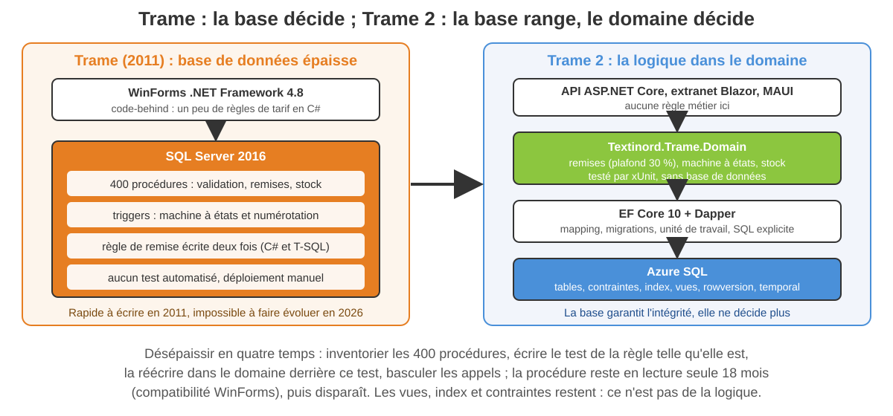
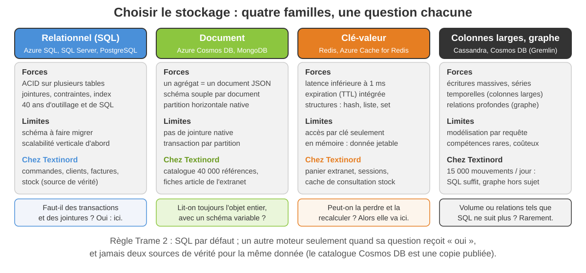
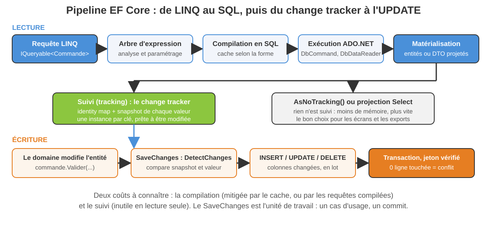
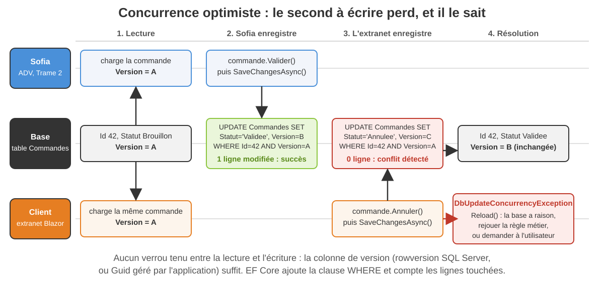

<!-- _class: lead -->

# Module 4

## Persistance : SQL, NoSQL, ADO.NET et EF Core

Architectures d'entreprise avec les technologies Microsoft
Jour 2, après-midi — 3 h 30

---

<!-- _class: dense -->

## Objectifs du module

À la fin de ce module, vous serez capable de :

- Diagnostiquer une **base de données épaisse** et planifier son désépaississement
- Choisir entre **SQL et NoSQL** avec des critères : relationnel, document, clé-valeur, colonnes, graphe
- Exploiter les **fonctionnalités d'un SGBD SQL** (ACID, isolation, index, rowversion, JSON, temporal) depuis .NET
- Accéder aux données avec **ADO.NET**, **Dapper** et **EF Core 10** : modélisation, migrations, requêtes, concurrence
- Sérialiser des données en base (JSON, blobs, Protobuf) sans dette cachée

<div class="key">

Le module 1 a décidé où vit la logique métier : dans le domaine. Le module 4 décide où vivent les données, et comment le domaine y accède **sans s'y dissoudre**.

</div>

---

<!-- _class: tight -->

## Plan de la demi-journée

1. Bases de données épaisses : le cas Trame
2. SQL vs NoSQL : cinq modèles, une grille de choix
3. Fonctionnalités d'un SGBD SQL
4. ADO.NET et Dapper
5. EF Core 10 (et Linq to SQL en legacy)
6. NoSQL en pratique et sérialisation en base

Fil rouge : **Textinord**. Trame stocke tout dans SQL Server 2016 derrière 400 procédures stockées. Trame 2 vise Azure SQL avec EF Core 10, un catalogue publié dans Cosmos DB et un cache Redis. La démo 4.1, les exercices 4.1 et 4.2 et le TP 4 construisent la persistance de `Textinord.Trame.Infrastructure`, sur le domaine écrit au TP 1.

---

<!-- _class: lead -->

# 1. Bases de données épaisses

---

<!-- _class: dense -->

## Le cas Trame : 400 procédures et des triggers

En 2011, l'équipe de Trame a écrit la logique là où elle était la plus rapide à tester : dans SQL Server. Quinze ans plus tard, Sofia Marques compte 400 procédures stockées, une trentaine de triggers et une règle de remise écrite deux fois, en C# et en T-SQL.

| Ce que la base épaisse apporte | Ce qu'elle coûte |
|---|---|
| proximité des données, pas d'aller-retour réseau | logique invisible depuis le code, hors de portée de xUnit |
| un déploiement = un script | versioning par script manuel, pas de revue de code |
| traitements de masse performants | montée en charge verticale seulement |
| une seule technologie à maîtriser en 2011 | compétence rare en 2026, couplage au moteur T-SQL |

Nadia Benali résume le risque : « deux développeurs connaissent ces procédures, et l'un des deux part en retraite en 2027 ».

---

<!-- _class: visual -->

## Trame contre Trame 2 : qui décide, qui range



---

<!-- _class: dense -->

## Désépaissir : où va la logique, dans quel ordre

- **Reste dans la base** : intégrité (clés, `CHECK`, unicité), index, vues de lecture, calculs de masse nocturnes, sécurité (RLS, chiffrement)
- **Part dans le domaine** : toute décision qui répond à « est-ce autorisé ? » ou « combien ? » : remise plafonnée à 30 %, transition d'état, validation de stock
- **Interdit des deux côtés** : la même règle écrite deux fois, comme la remise dans Trame
- **Ordre** : inventorier (procédures appelées, par qui), tester la règle telle qu'elle est, la réécrire dans `Textinord.Trame.Domain` derrière ce test, basculer les appels, garder la procédure en lecture seule 18 mois pour les postes WinForms

<div class="key">

Une procédure de 2 000 lignes qui « marche » n'est pas une raison de la garder : c'est une raison de la tester avant d'y toucher.

</div>

---

<!-- _class: lead -->

# 2. SQL vs NoSQL

---

<!-- _class: tight -->

## Cinq modèles de données, cinq façons de ranger

| Modèle | Unité de stockage | Points forts | Moteurs 2026 |
|---|---|---|---|
| Relationnel | ligne, table, jointure | ACID, contraintes, SQL, outillage | Azure SQL, SQL Server 2025, PostgreSQL 17 |
| Document | document JSON autonome | agrégat complet, schéma souple, partition | Azure Cosmos DB, MongoDB 8 |
| Clé-valeur | valeur opaque par clé | latence < 1 ms, TTL, simplicité | Redis, Azure Cache for Redis, Garnet |
| Colonnes larges | lignes par clé de partition | écritures massives, séries temporelles | Cassandra, Cosmos DB (API Cassandra) |
| Graphe | nœuds et arêtes | parcours de relations profondes | Cosmos DB (Gremlin), Neo4j |

« NoSQL » ne désigne pas une technologie mais quatre familles qui renoncent à une partie du relationnel (jointures, transactions globales, schéma imposé) pour gagner ailleurs.

---

<!-- _class: tight -->

## CAP, PACELC et cohérence : ce que l'on paie

- **CAP** : en cas de partition réseau, un système distribué choisit entre cohérence (C) et disponibilité (A). Un SGBD SQL sur un nœud n'est pas concerné : il n'est pas partitionné
- **PACELC** complète : hors panne (E), il reste l'arbitrage latence (L) contre cohérence (C) ; c'est le choix quotidien de Cosmos DB et de ses cinq niveaux de cohérence
- **Transactions** : ACID multi-tables en SQL ; par document ou par partition en NoSQL ; « transaction distribuée » = saga, au module 6
- **Schéma** : imposé par la base (SQL) ou par le code (NoSQL) ; il existe toujours quelque part
- **Scalabilité et coût** : verticale puis réplicas en lecture, facturée au vCore (Azure SQL) ; horizontale par partition, facturée en RU/s (Cosmos DB)

<div class="warn">

Une commande Textinord validée sur un stock lu « à cohérence éventuelle » peut être promise deux fois. La cohérence forte n'est pas un luxe pour la source de vérité.

</div>

---

<!-- _class: visual -->

## Quatre familles, une question chacune



---

<!-- _class: tight -->

## La grille de choix de Textinord

| Donnée | Moteur retenu | Pourquoi |
|---|---|---|
| Commandes, lignes, clients, factures | Azure SQL, EF Core 10 | transactions, contraintes, archivage 10 ans, reporting |
| Stock par entrepôt (source de vérité) | Azure SQL | 15 000 mouvements / jour, cohérence forte à la validation |
| Catalogue publié à l'extranet | Cosmos DB (API NoSQL) | 40 000 fiches lues entières, attributs variables par famille, copie publiée |
| Panier extranet, sessions | Redis | jetable, TTL, latence |
| Consultation de stock (P95 < 300 ms) | Redis devant Azure SQL | cache court (30 s), invalidation par événement |
| Journal d'audit | Azure SQL (temporal table), archivage Blob | traçabilité, coût de rétention |

<div class="key">

Un moteur par question, pas par équipe : chaque ligne de ce tableau est une **ADR** (module 1), avec sa date de revue.

</div>

---

<!-- _class: dense -->

## Exercice 4.1 — Choisir le stockage

- Six données Textinord à placer : commandes, catalogue, panier, sessions, journal d'audit, stock temps réel
- Pour chacune : famille, moteur Azure, justification en trois lignes, et ce que l'on perd
- Piège volontaire : deux réponses défendables pour une même donnée, à argumenter
- 20 minutes en binôme, restitution croisée

Document : `exercices/module-04/exercice-4-1-choisir-le-stockage.md`

<div class="key">

Livrable : un tableau de six lignes (donnée, famille, moteur, ce que l'on gagne, ce que l'on perd) qui deviendra l'ADR « stockage » du dépôt Trame 2.

</div>

---

<!-- _class: lead -->

# 3. Fonctionnalités d'un SGBD SQL

---

<!-- _class: tight -->

## ACID et niveaux d'isolation

**ACID** : atomicité (tout ou rien), cohérence (contraintes respectées), isolation (les transactions ne se voient pas), durabilité (commit = écrit). L'isolation est réglable, et c'est là que se jouent la performance et les anomalies.

| Niveau | Anomalies évitées | Usage Textinord |
|---|---|---|
| Read Uncommitted | aucune (lectures sales possibles) | jamais en production |
| Read Committed (défaut SQL Server) | lectures sales | transactions courtes de l'ADV |
| Read Committed Snapshot (RCSI) | lectures sales, sans bloquer les lecteurs | **recommandé** ; défaut sur Azure SQL |
| Repeatable Read | + lectures non répétables | rapprochement comptable |
| Snapshot | version cohérente au début de la transaction | reporting sur base vivante |
| Serializable | + lectures fantômes | numérotation `CMD-AAAA-NNNNNN` |

---

<!-- _class: tight -->

## Index, plans d'exécution, contraintes, verrous

- **Index** : clustered (ordre physique, un par table), non-clustered avec colonnes incluses, filtré, columnstore pour l'analytique ; chaque index coûte à l'écriture : 3 000 lignes / jour l'absorbent, 15 000 mouvements de stock demandent de compter
- **Plan d'exécution** : plan réel dans SSMS ou Azure Data Studio, `SET STATISTICS IO`, Query Store pour retrouver la régression d'hier ; symptôme classique : scan de `Commandes` faute d'index sur `Statut`
- **Contraintes** : clé primaire, unicité (`Numero`), clé étrangère, `CHECK (RemisePourcent <= 30)` : la base garantit l'invariant même si un script l'oublie
- **Verrous** : ligne, page, table, escalade ; blocage contre interblocage (deadlock, victime choisie) ; parades : transactions courtes, même ordre d'accès, RCSI

<div class="key">

Ce qu'EF Core ne décide pas pour vous : les index composés utiles, le plan, l'isolation. Les migrations les portent, l'architecte les choisit.

</div>

---

<!-- _class: packed -->

## SQL Server 2025, Azure SQL, PostgreSQL : ce qu'ils apportent

| Fonctionnalité | SQL Server 2025 / Azure SQL | PostgreSQL 17 |
|---|---|---|
| Jeton de concurrence | `rowversion` (8 octets, automatique) | `xmin` système ou colonne gérée |
| Historique | temporal tables (`SYSTEM_VERSIONING = ON`) | extension ou triggers |
| JSON | type `json` natif (2025), `JSON_VALUE`, index | `jsonb` indexable (GIN) |
| Sécurité | Row-Level Security, Always Encrypted, TDE, Entra ID | RLS, pgcrypto, TLS |
| Recherche vectorielle | type `vector` (2025) | pgvector |
| Cloud managé | Azure SQL Database (serverless, Hyperscale), Managed Instance | Azure Database for PostgreSQL Flexible Server |
| Provider EF Core | `Microsoft.EntityFrameworkCore.SqlServer` | `Npgsql.EntityFrameworkCore.PostgreSQL` |

Textinord reste sur SQL Server : compétences internes, coexistence avec Trame pendant 18 mois, authentification Entra ID à la base sans mot de passe dans la configuration.

---

<!-- _class: lead -->

# 4. ADO.NET

---

<!-- _class: tight -->

## Microsoft.Data.SqlClient : la couche de base

```csharp
await using var cnx = new SqlConnection(chaine);   // pool : rien à coder
await cnx.OpenAsync(ct);
await using var cmd = new SqlCommand(
    "SELECT Numero, Statut FROM Commandes WHERE ClientId = @client", cnx);
cmd.Parameters.Add("@client", SqlDbType.Int).Value = clientId;
await using var lecteur = await cmd.ExecuteReaderAsync(ct);
while (await lecteur.ReadAsync(ct))
{
    resultats.Add(new(lecteur.GetString(0), lecteur.GetString(1)));
}
```

- `System.Data.SqlClient` est figé : on cible **Microsoft.Data.SqlClient** (Entra ID, Always Encrypted)
- **Pool** automatique : ouvrir tard, fermer tôt ; **toujours paramétré** : ni injection, ni plan recompilé
- `DataReader` : curseur en avant seulement, le plus rapide ; `DataSet` reste pour l'interop WinForms de Trame

---

<!-- _class: tight -->

## Transactions, async et Dapper

```csharp
await using var tx = await cnx.BeginTransactionAsync(ct);
var resumes = await cnx.QueryAsync<CommandeResume>("""
    SELECT c.Numero, cl.RaisonSociale AS Client, c.Statut,
           COUNT(l.Id) AS NombreLignes
    FROM Commandes c JOIN Clients cl ON cl.Id = c.ClientId
    LEFT JOIN LignesCommande l ON l.CommandeId = c.Id
    WHERE c.Date >= @Debut
    GROUP BY c.Numero, cl.RaisonSociale, c.Statut
    """, new { Debut = jour }, tx);
await tx.CommitAsync(ct);
```

- **Dapper** : méthodes d'extension sur `IDbConnection`, mapping par nom de colonne vers un record, SQL explicite : les lectures d'écran et les exports (CQRS léger)
- **Transactions** : `BeginTransactionAsync` sur la connexion, ou `TransactionScope` avec `TransactionScopeAsyncFlowOption.Enabled` ; jamais distribuée (DTC, module 6)
- `async` de bout en bout : un thread libéré par requête en attente, condition des 99,9 % de disponibilité

---

<!-- _class: lead -->

# 5. EF Core 10

---

<!-- _class: tight -->

## DbContext, modélisation et migrations

```csharp
public sealed class TrameDbContext(DbContextOptions<TrameDbContext> o)
    : DbContext(o), IUniteDeTravail
{
    public DbSet<Commande> Commandes => Set<Commande>();
    protected override void OnModelCreating(ModelBuilder b) =>
        b.ApplyConfigurationsFromAssembly(typeof(TrameDbContext).Assembly);
}
// CommandeConfiguration : IEntityTypeConfiguration<Commande>
b.ToTable("Commandes"); b.HasIndex(c => c.Numero).IsUnique();
b.Property(c => c.Statut).HasConversion<string>().HasMaxLength(20);
b.HasMany(c => c.Lignes).WithOne().HasForeignKey("CommandeId");
b.Navigation(c => c.Lignes).HasField("_lignes");
```

- **Conventions** (`Id`, `ClientId`), **attributs** (`[MaxLength]`), **fluent** : le fluent gagne, et il tient le domaine à l'écart d'EF
- `dotnet ef migrations add Initiale` puis `database update` ; en production, `migrations script --idempotent` dans le pipeline, jamais `Migrate()` au démarrage

---

<!-- _class: visual -->

## De la requête LINQ à l'UPDATE : le pipeline



---

<!-- _class: tight -->

## Requêtes : chargements, suivi, projections

```csharp
// Écran ADV : projection, pas d'entité, pas de suivi
var lignes = await db.Commandes
    .Where(c => c.Statut == StatutCommande.Validee)
    .Select(c => new CommandeResume(c.Numero, c.Client!.RaisonSociale,
                                    c.Lignes.Count))
    .ToListAsync(ct);
// Cas d'usage métier : agrégat complet, suivi, puis SaveChanges
var commande = await db.Commandes
    .Include(c => c.Lignes).Include(c => c.Client)
    .FirstAsync(c => c.Id == id, ct);
```

- **Eager** (`Include`, `AsSplitQuery()` contre l'explosion cartésienne), **explicit** (`Entry(c).Collection(x => x.Lignes).LoadAsync()`), **lazy** (proxies : à éviter, source des N+1)
- **Tracking** pour modifier ; `AsNoTracking()` ou projection pour lire ; `AsNoTrackingWithIdentityResolution()` entre les deux
- Une expression non traduisible échoue franchement : pas d'évaluation côté client silencieuse

---

<!-- _class: visual -->

## Concurrence optimiste : le second à écrire perd



---

<!-- _class: packed -->

## Owned types, JSON, ExecuteUpdate et compagnie

| Fonctionnalité | Ce que ça change | Chez Textinord |
|---|---|---|
| Owned type, complex type | valeur sans identité, même table ; EF 10 : `ComplexProperty(c => c.Adresse).ToJson()` | `Adresse`, `Montant` |
| Colonne JSON (`ToJson()`) | agrégat sans table dédiée, filtrable en LINQ (`JSON_VALUE`) | `Metadonnees` de commande |
| `ExecuteUpdate` / `ExecuteDelete` | une instruction SQL, sans charger ni suivre | facturer 900 commandes expédiées |
| Requêtes compilées (`EF.CompileAsyncQuery`) | compilation faite une seule fois | consultation de stock, P95 < 300 ms |
| Intercepteurs (`IInterceptor`) | commande, connexion, SaveChanges | audit, suppression logique, tenant |
| `AddDbContextPool` | réutilise les instances de contexte | API sous charge |
| Transactions | `Database.BeginTransactionAsync`, `UseTransaction` partagée avec Dapper | commande + ordre de préparation |

---

<!-- _class: dense -->

## Repository, Unit of Work, Specification : quoi garder

- Le `DbContext` **est** une Unit of Work et un Identity Map : ne réécrivez ni `IUnitOfWork` générique, ni `IRepository<T>` dont le `GetAll()` expose `IQueryable` au métier
- Un **repository par agrégat** (`ICommandeRepository`) déclaré dans le domaine, implémenté dans Infrastructure : il charge l'agrégat complet, il ne sauvegarde pas
- **Specification** (module 1) pour les critères réutilisables : une `Expression<Func<Commande, bool>>` traduisible en SQL
- Les lectures d'écran ne passent pas par les agrégats : projection EF ou Dapper, premier pas vers CQRS

<div class="key">

Le test d'une bonne abstraction : peut-on remplacer SQLite par Azure SQL sans toucher au domaine ? Dans le TP 4, oui : c'est le plan B officiel.

</div>

---

<!-- _class: dense -->

## Legacy : de Linq to SQL à EF Core

- **Linq to SQL** (2007) : SQL Server seulement, mapping `.dbml`, `DataContext`, plus aucune évolution ; présent dans Trame pour les écrans de reporting
- **Entity Framework 6** : tourne sur .NET 10 mais gelé ; EDMX abandonné
- **Chemin** : entités POCO, `DbContext` EF Core avec configuration fluent équivalente, `dotnet ef dbcontext scaffold` pour partir de la base existante, tests de non-régression sur les requêtes traduites
- **Différences qui piquent** : pas de lazy loading par défaut, `GroupBy` traduit autrement, `DataContext.Log` remplacé par `LogTo` et les intercepteurs

<div class="warn">

Aucun nouveau code sur Linq to SQL ni sur EF6 : chaque écran migré vers Trame 2 passe sur EF Core 10.

</div>

---

<!-- _class: dense -->

## Démo 4.1 — EF Core sur le modèle Commande

- Migration initiale générée depuis les configurations fluent, lue ligne à ligne
- Requêtes : projection pour l'écran, agrégat suivi pour le cas d'usage, SQL affiché par `LogTo`
- Concurrence : deux contextes, une `DbUpdateConcurrencyException` provoquée en direct
- Colonne JSON : métadonnées de commande écrites, relues, filtrées en LINQ
- Plan B : SQLite en mémoire, aucun serveur, même code

Document : `demos/module-04/demo-4-1-ef-core-commandes.md`

<div class="key">

À retenir en sortant : le SQL généré se lit, le conflit de version se provoque en deux lignes, et le même code tourne sur SQLite et sur Azure SQL.

</div>

---

<!-- _class: dense -->

## Exercice 4.2 — Optimiser un DbContext

- Un `DbContext` et trois requêtes de Trame 2 fournis, avec leurs symptômes mesurés
- À trouver : un N+1, un suivi inutile, une projection manquante, un index absent
- Livrable : code corrigé, SQL généré avant / après, migration de l'index
- 25 minutes, en binôme

Document : `exercices/module-04/exercice-4-2-optimiser-un-dbcontext.md`

<div class="key">

Livrable : `TrameDbContext.cs` corrigé, le SQL avant / après de chaque requête (obtenu par `LogTo`), et la migration qui ajoute l'index manquant.

</div>

---

<!-- _class: lead -->

# 6. NoSQL et sérialisation en base

---

<!-- _class: tight -->

## Azure Cosmos DB : partition, RU, cohérence

- **Partition logique** : clé choisie à la création du conteneur, immuable ; pour le catalogue Textinord, `/famille` (lectures par famille, aucune partition au-delà de 20 Go)
- **RU/s** : unité de coût (1 RU ≈ lecture d'un document d'1 Ko par id) ; une requête inter-partitions coûte des dizaines de RU ; débit provisionné, autoscale ou serverless
- **Cohérence** : cinq niveaux, de Strong à Eventual ; **Session** (défaut) suffit à l'extranet : un client relit toujours ce qu'il vient d'écrire
- **Accès .NET** : SDK `Microsoft.Azure.Cosmos` (`ReadItemAsync`, `GetItemQueryIterator`) ou provider EF Core `Microsoft.EntityFrameworkCore.Cosmos` (partition et ETag gérés)
- **Modéliser** : imbriquer ce qui est lu ensemble (article, déclinaisons, tarifs publics), référencer ce qui est partagé ou volumineux (images dans Blob Storage) ; **MongoDB** : mêmes principes, driver officiel ou `MongoDB.EntityFrameworkCore`

---

<!-- _class: tight -->

## Redis : cache, panier, sessions

```csharp
builder.Services.AddStackExchangeRedisCache(o =>
    o.Configuration = builder.Configuration.GetConnectionString("Redis"));
builder.Services.AddHybridCache();      // L1 en mémoire + L2 Redis

var stock = await cache.GetOrCreateAsync(
    $"stock:{reference}",
    async ct => await lecture.StockAsync(reference, ct),
    new HybridCacheEntryOptions { Expiration = TimeSpan.FromSeconds(30) },
    cancellationToken: ct);
```

- `IDistributedCache` : octets et TTL ; **HybridCache** (.NET 9+) ajoute la sérialisation et la protection contre la ruée (stampede)
- Panier extranet : hash Redis par client, TTL 7 jours ; Blazor Server : état en mémoire, Redis en backplane SignalR
- Invalidation par événement `StockModifie` (module 6), jamais par devinette : un cache que l'on ne sait pas invalider est un bug différé

---

<!-- _class: packed -->

## Sérialiser en base : JSON, blobs, Protobuf

| Besoin | Solution 2026 | Point de vigilance |
|---|---|---|
| Attributs variables d'une commande | colonne JSON (`ToJson()`), `jsonb` | versionner le document : champ `SchemaVersion`, lecture tolérante |
| Sérialisation .NET | **System.Text.Json** : `JsonSerializerOptions` partagées, source generators (`[JsonSerializable]`, AOT) | culture, `DateTimeOffset`, enums en chaîne |
| Fichiers, images, EDI | Azure Blob Storage, chemin en base ; `FILESTREAM` en legacy | jamais 20 Mo de `varbinary(max)` dans une table transactionnelle |
| Contrats binaires, messages | Protobuf (`Google.Protobuf`, gRPC), MessagePack | schéma versionné, champs numérotés |
| `BinaryFormatter` | **supprimé de .NET 9** | les colonnes `image` de Trame sérialisées ainsi : migrer vers JSON avant la fin de .NET Framework |

Une donnée sérialisée est une donnée que l'on ne sait plus requêter ni migrer sans code : elle mérite un schéma versionné et un test de relecture.

---

<!-- _class: dense -->

## TP 4 — Persistance de Trame 2

- Modèle EF Core 10 (`Client`, `Article`, `Commande`, `LigneCommande`), configurations fluent, migration initiale
- Repository `Commande` et `DbContext` comme unité de travail, jeton de concurrence testé, métadonnées en colonne JSON
- Une lecture Dapper pour l'écran « commandes du jour »
- Tests d'intégration xUnit sur SQLite en mémoire : au moins 8, dont le conflit de concurrence
- Provider SQLite (plan B officiel) ; SQL Server LocalDB si disponible, même code

Document : `tp/module-04/tp-4-persistance-trame2.md` — 75 minutes

---

<!-- _class: dense -->

## Récapitulatif du module

- Une **base épaisse** se désépaissit règle par règle, derrière un test ; intégrité, index et vues restent dans la base
- **SQL par défaut** ; document, clé-valeur, colonnes ou graphe quand une question précise l'exige, avec une seule source de vérité
- Un SGBD SQL offre **ACID, isolation réglable (RCSI), index, contraintes, rowversion, temporal, JSON** : les migrations les portent, l'architecte les décide
- **ADO.NET** paramétré, pool, async ; **Dapper** pour les lectures SQL explicites
- **EF Core 10** : fluent, migrations scriptées, projection ou `AsNoTracking()` en lecture, concurrence optimiste, JSON, `ExecuteUpdate` ; le `DbContext` est déjà l'unité de travail
- **Cosmos DB** : partition et RU d'abord ; **Redis** : ce qui peut se perdre ; sérialiser, c'est versionner ; `BinaryFormatter` a disparu

---

<!-- _class: quiz -->

## Quiz — 1/5

**Q1.** Dans Trame, la règle de remise existe en C# et en T-SQL. Le premier geste de désépaississement est…

- a) supprimer la procédure stockée
- b) écrire un test qui fixe le comportement actuel de la règle
- c) réécrire la règle en C# et comparer à la main

**Q2.** Une base de données conserve légitimement…

- a) les transitions d'état de la commande
- b) les contraintes, les index et les vues de lecture
- c) le calcul de la remise plafonnée

---

<!-- _class: quiz -->

## Quiz — 2/5

**Q3.** Le théorème CAP s'applique…

- a) à tout SGBD, y compris SQL Server sur un seul nœud
- b) aux systèmes distribués, en cas de partition réseau
- c) uniquement aux bases de documents

**Q4.** Pour les 40 000 fiches du catalogue, lues entières, avec des attributs variables par famille, Textinord retient…

- a) Azure SQL comme unique moteur, sans copie
- b) Cosmos DB, en copie publiée depuis la source de vérité SQL
- c) Redis comme source de vérité

---

<!-- _class: quiz -->

## Quiz — 3/5

**Q5.** Le niveau d'isolation Read Committed Snapshot (RCSI) évite…

- a) les lectures sales, sans que les lecteurs bloquent les écrivains
- b) les lectures fantômes
- c) tout interblocage

**Q6.** Avec ADO.NET, une commande paramétrée sert d'abord à…

- a) accélérer le pool de connexions
- b) éviter l'injection SQL et réutiliser le plan d'exécution
- c) activer l'exécution asynchrone

---

<!-- _class: quiz -->

## Quiz — 4/5

**Q7.** Pour un écran de liste en lecture seule, la bonne requête EF Core…

- a) charge l'agrégat avec `Include` et le suit
- b) projette avec `Select`, ou lit avec `AsNoTracking()`
- c) active le lazy loading

**Q8.** Une `DbUpdateConcurrencyException` signifie…

- a) un interblocage détecté par SQL Server
- b) zéro ligne touchée par l'UPDATE, car le jeton de version a changé
- c) un dépassement du délai de commande

---

<!-- _class: quiz -->

## Quiz — 5/5

**Q9.** Le `DbContext` EF Core implémente déjà…

- a) Unit of Work et Identity Map
- b) un repository générique par entité
- c) le pattern Specification

**Q10.** `BinaryFormatter` dans .NET 10…

- a) est disponible derrière un indicateur de compatibilité
- b) a été supprimé : System.Text.Json ou Protobuf le remplacent
- c) reste réservé aux colonnes `varbinary` de SQL Server

Réponses commentées : lors de la correction en séance.

---

<!-- _class: lead -->

# Prochaine étape

## Module 5 — Communication, API et Cloud Azure

La persistance est en place : le domaine lit et écrit sans se dissoudre dans SQL. Reste à **exposer** Trame 2 : REST et OpenAPI, injection de dépendances, identité, puis Azure et les containers.

Jour 3, matin — 3 h 30
