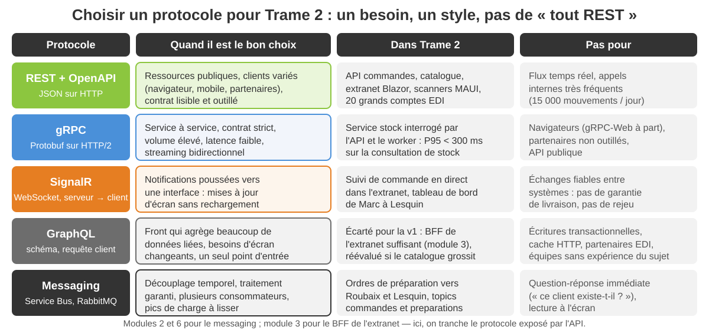
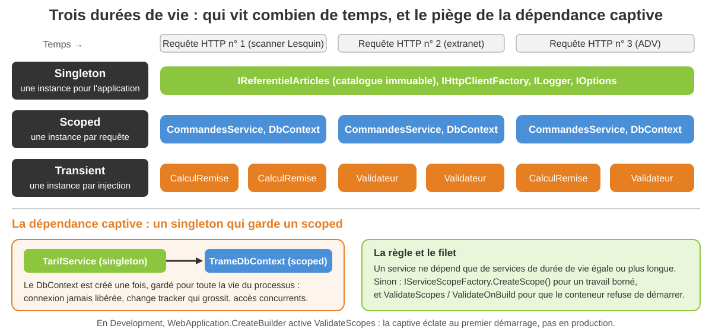
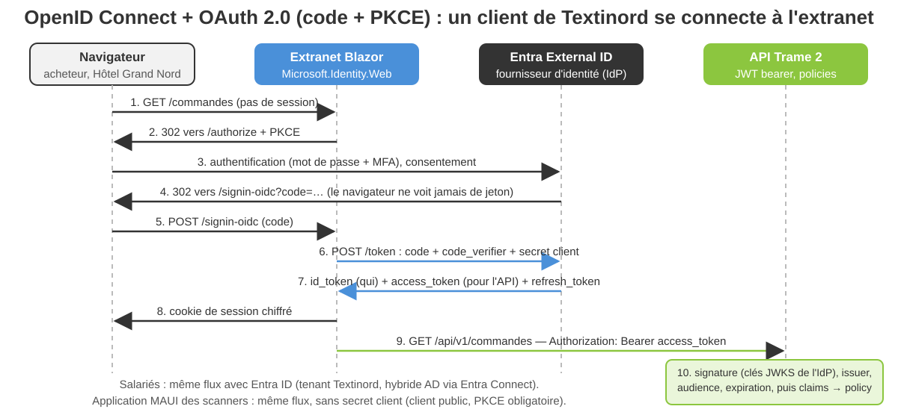
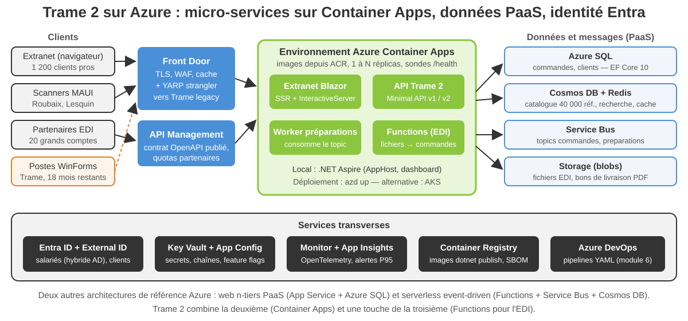

<!-- _class: lead -->

# Module 5

## Communication, API et Cloud Azure

Architectures d'entreprise avec les technologies Microsoft

Jour 3, matin — 3 h 30

---

<!-- _class: tight -->

## Objectifs du module

À la fin de ce module, vous serez capable de :

- **Choisir un protocole** (REST, gRPC, SignalR, messaging) et traiter WCF / SOAP comme un legacy à migrer, pas à reproduire
- Maîtriser **l'injection de dépendances** de .NET : durées de vie, Options, `IHttpClientFactory`, validation au démarrage
- Concevoir et coder une **API REST ASP.NET Core** versionnée, documentée en OpenAPI, avec ProblemDetails, filtres, rate limiting, health checks, OpenTelemetry
- Sécuriser l'API avec **JWT bearer, OIDC et Entra ID** ; appeler du code natif avec `LibraryImport`
- Placer Trame 2 sur **Azure** : services, architecture de référence, containers, .NET Aspire, Container Apps

<div class="key">

Fil rouge : l'API commandes de Trame 2, que Sofia Marques doit exposer à l'extranet, aux scanners de Marc Vandewalle et aux 20 partenaires EDI avant la fin de l'année.

</div>

---

<!-- _class: tight -->

## Plan de la demi-journée

1. Web services et SOA — ce qui reste, ce qui part
2. Injection de dépendances
3. REST et Web API
4. API ASP.NET Core et OpenAPI
5. P/Invoke et Interop
6. Identité : de WIF à OpenID Connect et Entra ID
7. Dans le cloud avec Azure

Fil rouge **Textinord** : Trame expose aujourd'hui des services WCF figés à des postes WinForms ;
Trame 2 doit servir un extranet Blazor, des scanners MAUI et des partenaires EDI avec une API
versionnée, sécurisée par Entra ID, hébergée sur Container Apps.

Démo 5.1 (API commandes : OpenAPI, JWT, Aspire), exercices 5.2 (durées de vie) et 5.1 (contrat
REST), TP 5 (API Trame 2 prête pour Azure).

---

<!-- _class: lead -->

# 1. Web services et SOA

---

<!-- _class: tight -->

## SOA : ce qui reste vrai en 2026

Trame a été « SOA » en 2011 : des services WCF, un contrat par service, un ESB imaginé et jamais construit. Les principes ont survécu ; l'outillage, non.

- **Contrat explicite**, publié et versionné : hier le WSDL, aujourd'hui OpenAPI ou un fichier `.proto`
- **Autonomie** : un service possède ses données ; personne n'écrit dans sa base à sa place
- **Contract-first** : on conçoit le contrat avant le code et on le fait relire par les consommateurs (exercice 5.1)
- **Découplage** : les consommateurs ne dépendent que du contrat, jamais de l'implémentation — d'où le versioning
- **Composition** : un processus (commande → préparation → expédition) traverse plusieurs services, par appels ou par messages

<div class="key">

SOA n'est pas mort, il a changé de vêtements : REST, gRPC, messaging et micro-services en sont les héritiers directs. L'ESB, lui, a laissé la place au bus de messages (module 6).

</div>

---

<!-- _class: tight -->

## Legacy — WCF et SOAP : lire, migrer, ne plus écrire

| Dans Trame (WCF, 2011) | Dans Trame 2 (2026) |
|---|---|
| `[ServiceContract]`, WSDL généré | contrat OpenAPI (Minimal API) ou `.proto` (gRPC) |
| `basicHttpBinding`, SOAP 1.1, XML | JSON sur HTTP, Protobuf sur HTTP/2 |
| IIS, fichiers `.svc`, `web.config` | Kestrel, container, `appsettings` + Key Vault |
| WS-Security, authentification Windows | OIDC / JWT bearer, Entra ID |
| clients « Add Service Reference » | clients générés par Kiota ou NSwag, `dotnet-grpc` |
| versioning impossible sans casser | versions d'URL, `api-supported-versions`, retrait planifié |

<div class="warn">

**CoreWCF** existe (serveur WCF sur .NET moderne) : on l'utilise uniquement pour **héberger un contrat existant le temps de la migration** — les 18 mois des postes WinForms — jamais pour un nouveau service. `dotnet-svcutil` génère un client si l'on doit encore *appeler* un SOAP tiers.

</div>

---

<!-- _class: visual -->

## Quel protocole pour quel besoin ?



---

<!-- _class: lead -->

# 2. Injection de dépendances

---

<!-- _class: packed -->

## Le conteneur .NET et les trois durées de vie

`Microsoft.Extensions.DependencyInjection` sert tout .NET (Generic Host, ASP.NET Core, MAUI, workers) : on enregistre, on résout par le constructeur, on libère avec le scope.

```csharp
builder.Services.AddSingleton<IReferentielArticles, ReferentielArticlesEnMemoire>();
builder.Services.AddScoped<CommandesService>();
builder.Services.AddTransient<IValidateur<CreerCommandeRequete>, CreerCommandeValidateur>();

public sealed class CommandesService(ICommandesStore store, IGenerateurNumero numeros,
    IReferentielClients clients, TimeProvider horloge, ILogger<CommandesService> logger)
{
    public Commande? Trouver(string numero) => store.Trouver(numero);
}
```

- **Singleton** : une instance pour la vie du processus — thread-safe obligatoire, aucun état par utilisateur
- **Scoped** : une instance par requête HTTP (ou par `CreateScope()`) — le `DbContext`, le service applicatif
- **Transient** : une instance à chaque injection — objets légers sans état, libérés avec le scope s'ils sont `IDisposable`

---

<!-- _class: visual -->

## Durées de vie et dépendances captives



---

<!-- _class: packed -->

## Keyed services, Options, IHttpClientFactory, décorateurs

```csharp
builder.Services.AddKeyedSingleton<INotificateur, NotificateurSms>("sms");
builder.Services.AddKeyedSingleton<INotificateur, NotificateurMail>("mail");

builder.Services.AddOptions<RateLimitingOptions>()
    .Bind(builder.Configuration.GetSection("RateLimiting"))
    .ValidateDataAnnotations().ValidateOnStart();

builder.Services.AddHttpClient<ClientStockLegacy>(client =>
        client.BaseAddress = new Uri("https://trame.textinord.local/stock/"))
    .AddStandardResilienceHandler();
```

- **Keyed services** (.NET 8+) : plusieurs implémentations d'un même contrat, choisies par `[FromKeyedServices("sms")]`
- **Options pattern** : la configuration devient un objet typé, validé au démarrage — jamais `IConfiguration` dans un service métier
- **`IHttpClientFactory`** : pool de handlers, résilience (`Microsoft.Extensions.Http.Resilience`) ; un `new HttpClient()` par appel épuise les sockets
- **Décorateurs** : Scrutor (`Decorate<ICommandesStore, StoreAvecCache>()`) ou fabrique manuelle ; **`ValidateScopes` / `ValidateOnBuild`** font refuser le démarrage sur une dépendance captive

---

<!-- _class: dense -->

## Exercice 5.2 — Quatre erreurs de durée de vie

- Un extrait de `Program.cs` et trois classes de Trame 2 vous sont fournis : ils compilent, démarrent, et tombent en production
- Repérez les quatre défauts : dépendance captive, `DbContext` singleton, `new HttpClient()` par appel, scope créé et jamais libéré
- Pour chacun : le symptôme observable en production, la correction, et la ligne de configuration qui l'aurait détecté au démarrage
- 20 minutes en binôme, correction collective

Document : `exercices/module-05/exercice-5-2-durees-de-vie-di.md`

---

<!-- _class: lead -->

# 3. REST et Web API

---

<!-- _class: tight -->

## Ressources, verbes et codes : le vocabulaire

Une API REST expose des **ressources** nommées (noms au pluriel, pas de verbe dans l'URL) que l'on manipule avec les verbes HTTP ; le code de réponse fait partie du contrat.

| Intention | Requête | Réponse attendue |
|---|---|---|
| Lister, filtrer, paginer | `GET /api/v1/commandes?statut=Validee&page=2` | 200 + page ; 400 si filtre invalide |
| Lire | `GET /api/v1/commandes/CMD-2026-004512` | 200 ; 404 ProblemDetails |
| Créer | `POST /api/v1/commandes` | 201 + `Location` ; 400 validation ; 422 règle métier |
| Remplacer, modifier | `PUT` (entier) ou `PATCH` (partiel) | 200 ou 204 ; 409 si conflit de version |
| Transition d'état | `POST /api/v1/commandes/{n}/validation` | 200 ; 409 si transition interdite |
| Supprimer, annuler | `DELETE /api/v1/commandes/{n}` | 204 ; 409 si déjà en préparation |

Une action métier qui n'est pas un CRUD (valider, annuler) devient une **sous-ressource** ou un POST explicite : on ne détourne pas PATCH pour cela.

---

<!-- _class: tight -->

## Versionner, paginer, filtrer : lire à l'échelle

- **Version dans l'URL** (`/api/v1/`) : visible, cacheable, simple pour les partenaires EDI ; en-tête ou query string possibles avec `Asp.Versioning`
- Une version **ne casse jamais** un client existant : ajouter un champ est compatible ; renommer ou retirer exige une v2 et une date de retrait (`Sunset`)
- **Pagination** obligatoire : 900 commandes par jour, 10 ans d'archives — `page` et `taille` plafonnée à 100, ou un curseur pour les flux ; total et nombre de pages dans le corps
- **Filtres** en query string sur des champs indexés (`statut`, `client`, `depuis`) ; tri explicite (`tri=date:desc`)

```csharp
var versions = app.NewApiVersionSet()
    .HasApiVersion(new ApiVersion(1, 0)).HasApiVersion(new ApiVersion(2, 0))
    .ReportApiVersions().Build();

var commandes = app.MapGroup("/api/v{version:apiVersion}/commandes")
    .WithApiVersionSet(versions);
commandes.MapGet("/{numero}", ObtenirV2).MapToApiVersion(2.0);
```

---

<!-- _class: tight -->

## ProblemDetails (RFC 9457) et idempotence

```json
{ "type": "https://trame.textinord.example/problemes/transition-interdite",
  "title": "Opération impossible dans l'état actuel de la commande",
  "status": 409,
  "detail": "Passage Annulee → Validee interdit pour la commande CMD-2026-004512.",
  "instance": "POST /api/v1/commandes/CMD-2026-004512/validation",
  "code": "TRANSITION_INTERDITE", "traceId": "00-8a76a113a7c6b75e-8ce4af07-01" }
```

- `AddProblemDetails()` + `UseExceptionHandler()` + `UseStatusCodePages()` : **une seule forme d'erreur**, y compris pour 401, 404 et 500 ; `TypedResults.Problem` et `ValidationProblem` pour les cas explicites
- Le `type` est une URI **stable** que le client teste ; `code` reprend l'erreur du pattern Result du domaine
- **Idempotence** : GET, PUT, DELETE le sont par définition, POST non — un en-tête `Idempotency-Key` (le numéro EDI du partenaire) permet de rejouer sans doublon
- Les états se protègent par un **409** ou par `ETag` / `If-Match` (concurrence optimiste, module 4)

---

<!-- _class: dense -->

## Exercice 5.1 — Concevoir le contrat REST des commandes

- Julien Delcourt a besoin du contrat pour l'ADR « API commandes » : ressources, verbes, codes, versioning, pagination et filtres, sous forme de tableau
- Couvrez les cas métier : création, validation (stock disponible ou attente), annulation avant préparation, ordres de préparation par entrepôt, consultation par un partenaire EDI
- Tranchez : quelle version pour la remise expliquée, quels codes pour chaque échec, comment paginer dix ans d'archives
- 25 minutes en binôme ; votre tableau devient la spécification du TP 5

Document : `exercices/module-05/exercice-5-1-contrat-rest-commandes.md`

---

<!-- _class: lead -->

# 4. API ASP.NET Core et OpenAPI

---

<!-- _class: packed -->

## Minimal APIs : un endpoint complet

```csharp
commandes.MapPost("/", Creer)
    .RequireAuthorization(Politiques.EcritureCommandes)
    .AddEndpointFilter<ValidationFilter<CreerCommandeRequete>>();

static Results<Created<CommandeDetailV1>, ProblemHttpResult> Creer(
    CreerCommandeRequete requete, CommandesService service)
{
    var resultat = service.Creer(requete);
    return resultat.Commande is { } commande
        ? TypedResults.Created($"/api/v1/commandes/{commande.Numero}",
            commande.VersDetailV1())
        : Problemes.ClientInconnu(resultat.Valeur!);
}
```

- **Minimal APIs** pour les API de Trame 2 : handlers typés, `MapGroup`, filtres ; les **contrôleurs MVC** gardent leur place avec des vues ou un model binding complexe
- Le type `Results<A, B>` et `TypedResults` alimentent OpenAPI **sans attribut** ; les DTO sont des records distincts du domaine
- Le handler ne porte aucune règle métier : il traduit un `Result` en code HTTP

---

<!-- _class: tight -->

## Filtres, validation, rate limiting, santé, télémétrie

- **Endpoint filters** : `IEndpointFilter` autour du handler — validation (400 `ValidationProblem`), journalisation, idempotence ; en .NET 10, `AddValidation()` valide aussi les DataAnnotations des paramètres
- **Rate limiting** : `AddRateLimiter` + `RequireRateLimiting("api")`, partition par utilisateur ou par IP, 429 + `Retry-After` — le partenaire EDI qui a envoyé 20 000 requêtes en dix minutes ne pénalise plus les autres
- **Output caching** : `CacheOutput("referentiel")` sur les lectures stables (statuts, familles) ; jamais sur une réponse authentifiée sans `VaryByHeader`
- **Health checks** : `/health/live` (le processus répond) et `/health/ready` (dépendances prêtes) — Container Apps s'en sert pour redémarrer ou retirer du trafic
- **OpenTelemetry** : `AddOpenTelemetry().WithTracing().WithMetrics()` et les logs ; une `ActivitySource` métier (`commande.valider`) ; export console, OTLP (dashboard Aspire), Azure Monitor
- **CORS** : politique nommée, origines de l'extranet en configuration ; jamais `AllowAnyOrigin` avec des cookies

---

<!-- _class: packed -->

## OpenAPI intégré, Scalar, clients générés, tests de contrat

```csharp
builder.Services
    .AddApiVersioning(o => o.ReportApiVersions = true)
    .AddApiExplorer(o => o.GroupNameFormat = "'v'VVV")
    .AddOpenApi(o => o.Document
        .AddDocumentTransformer<DocumentTrameTransformer>());

app.MapOpenApi().WithDocumentPerVersion();       // /openapi/v1.json, v2.json
app.MapScalarApiReference(o => o.AddDocuments("v1", "v2"));   // /scalar
```

- `Microsoft.AspNetCore.OpenApi` produit le document à l'exécution ou **au build** (`Microsoft.Extensions.ApiDescription.Server`) : commentaires XML, `WithSummary`, codes déduits des `TypedResults`
- **Swagger UI** ou **Scalar** : même spécification, une interface pour tester avec un jeton ; en production, le document reste interne et API Management le republie
- **Clients générés** : Kiota (`kiota generate -l CSharp -d openapi/v1.json`) ou NSwag pour l'extranet et l'app MAUI ; **test de contrat** : document versionné dans Git, un test échoue si le contrat change sans nouvelle version

---

<!-- _class: dense -->

## Démo 5.1 — API commandes : OpenAPI, JWT, Aspire

- `dotnet new webapi`, puis le groupe `/api/v1/commandes` : liste paginée, détail, création avec filtre de validation, `TypedResults`
- OpenAPI et Scalar en direct ; `dotnet user-jwts create --role adv` pour obtenir un jeton : 401, puis 403, puis 201
- L'AppHost .NET Aspire : `dotnet run`, le dashboard, une trace `commande.creer` de bout en bout
- `dotnet publish /t:PublishContainer` : l'image sans Dockerfile — 15 à 20 minutes au total

Document : `demos/module-05/demo-5-1-minimal-api-openapi-jwt-aspire.md`

---

<!-- _class: lead -->

# 5. P/Invoke et Interop

---

<!-- _class: packed -->

## Appeler du code natif : LibraryImport et le marshalling

```csharp
using System.Runtime.InteropServices;

internal static partial class Bascule
{
    // Pilote natif du pont-bascule de Lesquin : libbascule.so ou bascule.dll
    [LibraryImport("bascule", StringMarshalling = StringMarshalling.Utf8)]
    [UnmanagedCallConv(CallConvs = [typeof(CallConvCdecl)])]
    internal static partial int LirePoids(string port, out double kilogrammes);
}

var code = Bascule.LirePoids("COM3", out var poids);
if (code != 0) throw new InvalidOperationException($"Bascule : erreur {code}");
```

- **`LibraryImport`** (générateur de source, .NET 7+) remplace `DllImport` : le marshalling est généré à la compilation, lisible, compatible **NativeAOT** et trimming ; `DllImport` reste pour le code existant
- **Marshalling** : types blittables (`int`, `double`, `struct` sans référence) passent tels quels ; chaînes via `StringMarshalling` ; tableaux et callbacks via `[MarshalAs]` ou un marshaller personnalisé ; tout handle natif dans un **`SafeHandle`**
- **COM** (Windows) : `ComWrappers` et `[GeneratedComInterface]` ; C++/CLI : Windows seulement, sans NativeAOT ; binaires natifs livrés par RID dans le NuGet

---

<!-- _class: lead -->

# 6. Identité : de WIF à OpenID Connect et Entra ID

---

<!-- _class: tight -->

## Legacy — WIF : ce qui reste, ce qui le remplace

| Windows Identity Foundation (2010-2016) | ASP.NET Core 10 |
|---|---|
| WS-Federation, SAML 1.1, STS AD FS | **OpenID Connect / OAuth 2.0** ; SAML 2.0 fédéré par Entra |
| `FederatedAuthentication`, `<system.identityModel>` | `AddAuthentication().AddOpenIdConnect()` ou `AddJwtBearer()` |
| `ClaimsPrincipal`, `ClaimsIdentity` | **toujours là** : `HttpContext.User`, mêmes types, mêmes claims |
| `ClaimsAuthorizationManager` | **policies** : `AddPolicy`, `RequireRole`, `RequireClaim` |
| fournisseur AD FS on-premise | **Entra ID** (salariés, hybride AD), **Entra External ID** (clients) |
| intégration manuelle | **Microsoft.Identity.Web** : `AddMicrosoftIdentityWebApp` / `WebApi`, section `AzureAd` |

<div class="key">

WIF a été fusionné dans .NET 4.5 puis abandonné ; son héritage utile, le modèle de **claims**, est au cœur d'ASP.NET Core. Le reste (WS-Fed, STS, XML) se migre vers OIDC — et c'est la fin du « groupes AD = droits » de Trame (module 6).

</div>

---

<!-- _class: visual -->

## Le flux OpenID Connect de l'extranet Trame 2



---

<!-- _class: packed -->

## JWT bearer, claims et policies : sécuriser l'API

```csharp
builder.Services.AddAuthentication(JwtBearerDefaults.AuthenticationScheme)
    .AddJwtBearer(o =>
    {
        o.MapInboundClaims = false;          // "sub" et "role" restent tels quels
        o.TokenValidationParameters.RoleClaimType = "role";
    });

builder.Services.AddAuthorizationBuilder()
    .AddPolicy("commandes.lecture",
        p => p.RequireRole("adv", "entrepot", "partenaire"))
    .AddPolicy("commandes.ecriture", p => p.RequireRole("adv"));
```

- Le jeton est **validé localement** : signature (clés JWKS de l'IdP, en cache), `iss`, `aud`, `exp` — aucun appel réseau par requête
- En local, `dotnet user-jwts create --role adv` écrit la section `Authentication:Schemes:Bearer` ; en production, `AddMicrosoftIdentityWebApi(builder.Configuration)` lit `AzureAd` et valide les jetons **Entra ID**
- Les **rôles** viennent des app roles Entra (groupes AD → rôles, module 6) ; les **scopes** (`scp`) bornent ce qu'une application peut demander pour l'utilisateur

---

<!-- _class: lead -->

# 7. Dans le cloud avec Azure

---

<!-- _class: tight -->

## IaaS, PaaS, SaaS, FaaS : la responsabilité partagée

| Modèle | Textinord gère | Azure gère | Exemple Trame 2 |
|---|---|---|---|
| IaaS | OS, runtime, correctifs, sauvegardes | matériel, réseau, hyperviseur | VM SQL Server 2016 rehébergée pendant la transition |
| PaaS | code, configuration, données | OS, runtime, montée en charge | Container Apps, Azure SQL, Service Bus |
| FaaS | fonctions et déclencheurs | tout le reste, facturé à l'exécution | Azure Functions : import EDI nocturne |
| SaaS | utilisateurs, paramétrage | l'application entière | Entra ID, Azure DevOps, Microsoft 365 |

<div class="key">

**Well-Architected Framework** : cinq piliers pour juger une architecture Azure — fiabilité, sécurité, optimisation des coûts, excellence opérationnelle, efficacité des performances. Trame 2 vise le PaaS partout où c'est possible : moins à exploiter pour les six développeurs de Sofia.

</div>

Trois architectures de référence Azure : **web n-tiers PaaS** (App Service + Azure SQL), **micro-services sur Container Apps** (le choix de Trame 2), **serverless event-driven** (Functions + Service Bus + Cosmos DB).

---

<!-- _class: packed -->

## Services Azure par usage pour Trame 2

| Besoin | Service retenu | Alternative, et quand |
|---|---|---|
| Héberger API, extranet, worker | **Azure Container Apps** (images, scale-to-zero, sondes) | App Service sans containers ; AKS pour un contrôle Kubernetes complet |
| Traitements déclenchés | **Azure Functions** (fichiers EDI) | Container Apps Jobs, WebJobs |
| Commandes, clients | **Azure SQL Database** | Azure Database for PostgreSQL |
| Catalogue, recherche, cache | **Cosmos DB** + **Azure Cache for Redis** | Azure AI Search pour le plein texte |
| Messages, événements | **Service Bus** (topics, dead letter) | Event Grid (événements), Event Hubs (flux) |
| Fichiers, PDF, EDI | **Blob Storage** | Azure Files (SMB) pour les partages legacy |
| Identité, secrets, configuration | **Entra ID / External ID**, **Key Vault**, **App Configuration** | variables d'environnement en développement seulement |
| Observabilité | **Monitor + Application Insights** (OpenTelemetry) | Grafana managé pour les tableaux de bord |
| Bord réseau, contrat | **Front Door** (WAF, TLS), **API Management** | Application Gateway (régional) |

---

<!-- _class: visual -->

## Architecture Azure cible de Textinord



---

<!-- _class: packed -->

## Containers : Dockerfile multi-stage ou PublishContainer

```dockerfile
FROM mcr.microsoft.com/dotnet/sdk:10.0 AS build
WORKDIR /src
COPY src/Textinord.Trame.Api/*.csproj src/Textinord.Trame.Api/
RUN dotnet restore src/Textinord.Trame.Api
COPY . .
RUN dotnet publish src/Textinord.Trame.Api -c Release -o /app --no-restore

FROM mcr.microsoft.com/dotnet/aspnet:10.0
WORKDIR /app
USER $APP_UID
COPY --from=build /app .
ENTRYPOINT ["dotnet", "Textinord.Trame.Api.dll"]
```

- **Multi-stage** : le SDK (900 Mo) compile, seul le runtime (220 Mo) est livré ; utilisateur non root, port 8080, TLS terminé par l'ingress
- **Sans Dockerfile** : `dotnet publish /t:PublishContainer` construit la même image depuis le csproj (`ContainerRepository`, `ContainerPort`) et la pousse vers ACR ; sans démon Docker, `ContainerArchiveOutputPath` produit une archive
- **Alternatives** : Podman (sans démon, rootless), containerd et nerdctl ; le standard est l'image OCI, pas l'outil

---

<!-- _class: packed -->

## .NET Aspire et azd : orchestrer, observer, déployer

```csharp
var builder = DistributedApplication.CreateBuilder(args);

var bus = builder.AddRabbitMQ("bus");      // container local ; Service Bus en production
var api = builder.AddProject<Projects.Textinord_Trame_Api>("trame-api")
    .WithHttpHealthCheck("/health/ready")
    .WithReference(bus).WaitFor(bus)
    .WithExternalHttpEndpoints();

builder.Build().Run();
```

- **AppHost** : la topologie en C# ; `dotnet run` lance projets et containers de dépendances, injecte chaînes de connexion et `OTEL_EXPORTER_OTLP_ENDPOINT`
- **Dashboard** : ressources, logs structurés, traces, métriques, sans rien installer ; **découverte de services** : `http://trame-api` résolu par nom
- **`azd init` puis `azd up`** : lit l'AppHost, crée ACR, environnement Container Apps et identités, déploie chaque projet ; `azd down` supprime tout
- Aspire 13 n'exige plus de workload (SDK `Aspire.AppHost.Sdk` + NuGet) ; `ServiceDefaults` regroupe OpenTelemetry, health checks et résilience

---

<!-- _class: dense -->

## TP 5 — API Trame 2 prête pour Azure

- Construisez l'API commandes : Minimal API versionnée v1 / v2, ProblemDetails, OpenAPI + Scalar, JWT bearer (`dotnet user-jwts`), policies `adv` / `entrepot` / `partenaire`
- Ajoutez l'exploitation : health checks, rate limiting, OpenTelemetry console, au moins huit tests `WebApplicationFactory` (401, 403, 404, 409, validation, versions)
- Préparez le déploiement : `Dockerfile` ou `PublishContainer`, AppHost Aspire, script `az` commenté pour Container Apps (plan B : exécution locale)
- 60 minutes en séance sur les étapes 1 à 5 ; étapes 6 et 7 en autonomie ; corrigé compilable fourni

Document : `tp/module-05/tp-5-api-trame2-azure.md`

---

<!-- _class: dense -->

## Récapitulatif du module

- SOA survit par ses principes (contrat, autonomie, contract-first) ; WCF / SOAP se lisent et se migrent, CoreWCF ne sert qu'à la transition
- REST pour l'API exposée, gRPC pour l'interne à fort volume, SignalR pour pousser vers l'écran, messaging pour découpler
- DI : singleton, scoped, transient — jamais de dépendance captive ; Options validées au démarrage, `IHttpClientFactory`, keyed services
- Une API REST : ressources, verbes, codes ; versionnée, paginée ; **ProblemDetails** partout ; Minimal APIs, `TypedResults`, filtres, OpenAPI intégré et Scalar
- Identité : claims et policies d'ASP.NET Core, JWT bearer validé localement, OIDC avec Entra ID / External ID et Microsoft.Identity.Web ; WIF est un souvenir
- Azure : PaaS d'abord (Container Apps, Azure SQL, Service Bus), images par `dotnet publish`, .NET Aspire en local, `azd` ou `az` pour déployer

---

<!-- _class: quiz -->

## Quiz — 1/5

**Q1.** Dans Trame 2, CoreWCF sert à…

- a) écrire les nouveaux services internes
- b) héberger les contrats SOAP existants le temps de la migration
- c) remplacer gRPC pour les appels à fort volume

**Q2.** Un `DbContext` enregistré en singleton provoque…

- a) de meilleures performances grâce au cache du change tracker
- b) une dépendance captive : connexion jamais libérée, tracker qui grossit
- c) rien de particulier, EF Core gère la concurrence

---

<!-- _class: quiz -->

## Quiz — 2/5

**Q3.** La réponse REST correcte à la création d'une commande est…

- a) 200 avec la commande dans le corps
- b) 201 avec un en-tête `Location` vers la ressource créée
- c) 204 sans corps

**Q4.** ProblemDetails (RFC 9457) sert à…

- a) documenter l'API à la place d'OpenAPI
- b) donner une forme unique, lisible par une machine, à toutes les erreurs
- c) remplacer les codes de statut HTTP

---

<!-- _class: quiz -->

## Quiz — 3/5

**Q5.** Retourner `Results<Ok<T>, ProblemHttpResult>` avec `TypedResults`…

- a) ralentit le handler
- b) laisse OpenAPI et le compilateur connaître les codes et les types de réponse
- c) impose de passer aux contrôleurs MVC

**Q6.** `LibraryImport` par rapport à `DllImport`…

- a) génère le marshalling à la compilation et fonctionne avec NativeAOT
- b) ne fonctionne que sur Windows
- c) est déprécié depuis .NET 8

---

<!-- _class: quiz -->

## Quiz — 4/5

**Q7.** Un jeton JWT bearer est validé par l'API…

- a) en appelant le fournisseur d'identité à chaque requête
- b) localement : signature, émetteur, audience, expiration
- c) en le comparant à une table de jetons en base

**Q8.** Ce qui remplace Windows Identity Foundation en 2026 :

- a) ASP.NET Core Authentication, OIDC, Microsoft.Identity.Web et Entra ID
- b) ASP.NET Core Identity seul, sans fournisseur externe
- c) l'authentification Windows intégrée de Kestrel

---

<!-- _class: quiz -->

## Quiz — 5/5

**Q9.** `dotnet publish /t:PublishContainer`…

- a) exige un Dockerfile à la racine du projet
- b) construit une image OCI à partir du csproj, sans Dockerfile
- c) déploie directement sur Azure Container Apps

**Q10.** L'AppHost .NET Aspire…

- a) remplace Kubernetes en production
- b) décrit la topologie en C#, lance projets et dépendances, alimente le dashboard
- c) est réservé à Visual Studio sous Windows

Réponses commentées : lors de la correction en séance.

---

<!-- _class: lead -->

# Prochaine étape

## Module 6 — Legacy, messaging, identité d'entreprise et industrialisation

L'API est prête et sécurisée. Cet après-midi : brancher le bus (RabbitMQ, Service Bus, MassTransit, Outbox), fédérer Active Directory et Entra ID, puis industrialiser la livraison (Azure DevOps, GitHub Actions, tests, releases).
