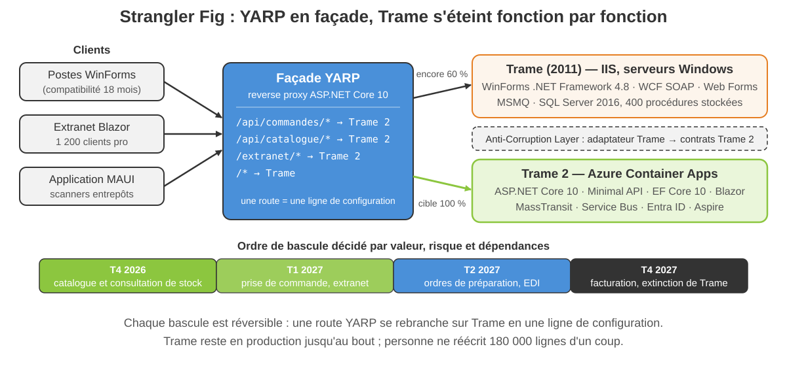
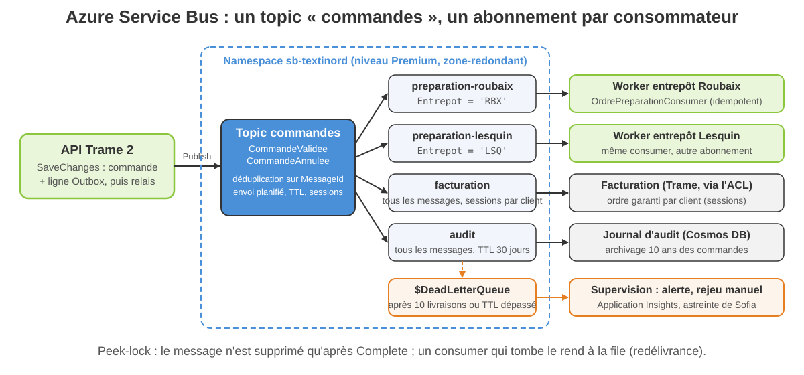
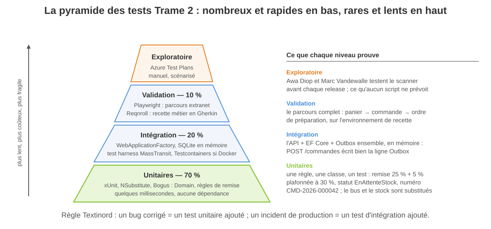
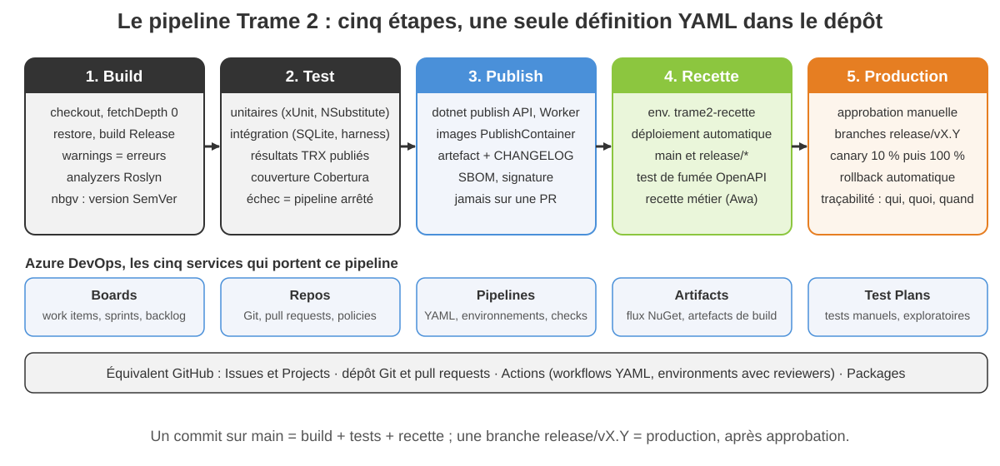

<!-- _class: lead -->

# Module 6

## Legacy, messaging, identité d'entreprise et industrialisation

Architectures d'entreprise avec les technologies Microsoft — Jour 3, après-midi — 3 h 30

---

<!-- _class: tight -->

## Objectifs du module

À la fin de cette demi-journée, vous serez capable de :

- **Choisir une stratégie de modernisation** (rehost, replatform, refactor, rebuild) et l'appliquer avec Strangler Fig, YARP et une Anti-Corruption Layer
- **Remplacer MSMQ** par RabbitMQ ou Azure Service Bus derrière MassTransit, avec Outbox, idempotence et dead letter
- **Abandonner les transactions distribuées** (MTS / DTC) au profit de `TransactionScope` local, de l'Outbox et des sagas
- **Brancher Trame 2 sur l'annuaire** : LDAP, Active Directory, Entra ID hybride, fédération OIDC / SAML
- **Industrialiser** : tests unitaires, d'intégration et de validation, SemVer, releases, pipelines Azure DevOps et GitHub Actions

<div class="key">

Dernière demi-journée : on ferme les chapitres « produits legacy » et « industrialisation » du programme, et on livre Trame 2 avec un pipeline.

</div>

---

<!-- _class: tight -->

## Plan de la demi-journée

1. Compatibilité avec les anciennes architectures : stratégies, outillage, Strangler Fig avec YARP
2. Messaging d'entreprise : de MSMQ à RabbitMQ, ActiveMQ Artemis et Azure Service Bus ; MassTransit, Outbox
3. Transactions : de MTS / COM+ / DTC à `TransactionScope`, Outbox et sagas
4. LDAP, Active Directory, Entra ID et fédération d'identités
5. Industrialisation : usine logicielle, ALM, méthodologies, versions, tests, releases, Azure DevOps et GitHub Actions

Fil rouge : **Textinord** livre la première version de **Trame 2** en production. Julien Delcourt ordonne la migration, Sofia Marques industrialise, Marc Vandewalle attend des ordres de préparation qui ne se perdent plus, Awa Diop veut des releases prévisibles.

Démo 6.1, exercices 6.1 et 6.2, TP 6 « Industrialiser Trame 2 », quiz, puis clôture de la formation.

---

<!-- _class: lead -->

# 1. Compatibilité avec les anciennes architectures

---

<!-- _class: packed -->

## Quatre stratégies et l'outillage de migration

| Stratégie | Ce qu'on fait | Coût / risque | Brique Textinord |
|---|---|---|---|
| **Rehost** | même code, autre hébergement (VM Azure, conteneur Windows) | faible / faible, dette intacte | serveur IIS de Trame pendant la transition |
| **Replatform** | même code, plateforme modernisée (.NET Framework 4.8 → .NET 10) | moyen / moyen | WinForms ADV porté sur .NET 10 (18 mois de coexistence) |
| **Refactor** | même fonctionnel, architecture reprise (couches, tests, API) | élevé / maîtrisé si progressif | commandes, ordres de préparation, tarifs |
| **Rebuild** | on réécrit, autre produit ou autre technologie | élevé / élevé | site marchand Web Forms → Blazor |

- **.NET Upgrade Assistant** (`dotnet upgrade`) convertit les `.csproj` et signale les API absentes ; les **analyseurs de compatibilité** (`Microsoft.DotNet.Analyzers.Compatibility`, `ApiPort`) inventorient Remoting, `BinaryFormatter`, `System.Web`
- **.NET Standard 2.0** : le pont pour les bibliothèques partagées entre Trame (4.8) et Trame 2 (10) ; **System.Web adapters** : session et authentification partagées le temps du Strangler ; **Windows Compatibility Pack** pour ce qui reste Windows
- L'outil migre la syntaxe, pas l'architecture : 180 000 lignes de code-behind compilent sur .NET 10 sans devenir testables. Une stratégie **par brique**, tranchée dans un ADR (module 1)

---

<!-- _class: visual -->

## Strangler Fig : YARP en façade de Trame



---

<!-- _class: tight -->

## La façade YARP et l'Anti-Corruption Layer

```json
"ReverseProxy": {
  "Routes": {
    "commandes": { "ClusterId": "trame2",
                   "Match": { "Path": "/api/commandes/{**rest}" } },
    "legacy":    { "ClusterId": "trame", "Match": { "Path": "{**rest}" } }
  },
  "Clusters": {
    "trame2": { "Destinations": { "d": { "Address": "https://trame2/" } } },
    "trame":  { "Destinations": { "d": { "Address": "http://iis-trame/" } } }
  }
}
```

- Package `Yarp.ReverseProxy` dans un projet ASP.NET Core 10 : `AddReverseProxy().LoadFromConfig(...)` puis `MapReverseProxy()` ; une route de plus = une fonctionnalité de plus sur Trame 2
- L'**Anti-Corruption Layer** est un adaptateur : Trame 2 ne manipule jamais les `DataSet` WCF ni les procédures stockées de Trame ; une classe `TrameLegacyAdapter` traduit vers `Commande`

---

<!-- _class: dense -->

## Exercice 6.1 — Plan de migration Strangler de Trame

- Cinq fonctionnalités de Trame à ordonner : catalogue et stock, prise de commande, ordres de préparation, facturation, EDI grands comptes
- Trois critères notés de 1 à 5 : valeur métier, risque technique, dépendances (données, MSMQ, procédures stockées)
- Livrable : l'ordre de bascule justifié et la table de routes YARP (route, cluster, date de bascule, critère de retour arrière)
- 20 minutes en binôme, puis deux binômes défendent leur ordre devant Julien Delcourt (le formateur)

Document : `exercices/module-06/exercice-6-1-plan-de-migration-strangler.md`

---

<!-- _class: lead -->

# 2. Messaging d'entreprise

---

<!-- _class: tight -->

## MSMQ : legacy Windows, absent de .NET

| Ce que Trame utilise | Ce que ça coûte | Ce qui le remplace |
|---|---|---|
| `System.Messaging`, files privées `.\private$\ordres` | .NET Framework uniquement, aucun package pour .NET 10 | RabbitMQ (on-premise, Docker) ou Azure Service Bus |
| files locales sur chaque serveur d'entrepôt | messages perdus au reboot (files non transactionnelles), aucune supervision | broker central, persistance, dead letter, métriques |
| format binaire, `XmlMessageFormatter` | contrats figés, clients non-.NET exclus | JSON ou Protobuf, contrats versionnés |

<div class="key">

Chemin de migration : on ne porte pas MSMQ, on **remplace le canal**. Le code métier ne parle qu'à une abstraction (MassTransit) ; le transport est un choix de configuration. Pendant la transition, un **message bridge** relit la file MSMQ de Lesquin et republie sur le bus.

</div>

---

<!-- _class: tight -->

## RabbitMQ : AMQP, exchanges, files, bindings, ack, DLX

- Le producteur publie sur un **exchange** (direct, topic, fanout, headers), jamais dans une file ; les **bindings** routent vers les **files**
- Le consommateur **acquitte** (`ack`) après traitement ; sans ack (plantage), le message est redélivré ; `nack` sans remise en file → **dead letter exchange**
- Files durables, messages persistants, confirmations éditeur : les trois ensemble pour ne rien perdre
- **Prefetch** : nombre de messages non acquittés par consommateur (10 pour les ordres de préparation, pas 1 000)
- Où : on-premise Windows ou Linux, Docker en développement, service managé (CloudAMQP, Container Apps) en production
- Chez Textinord : bus **local de développement** et entrepôts sans dépendance à Azure ; package `MassTransit.RabbitMQ`, hôte choisi par configuration

---

<!-- _class: visual -->

## Azure Service Bus : la topologie de Trame 2



---

<!-- _class: packed -->

## RabbitMQ, ActiveMQ Artemis, Azure Service Bus : comparatif

| Critère | RabbitMQ | ActiveMQ Artemis | Azure Service Bus |
|---|---|---|---|
| Protocole | AMQP 0-9-1 (+ MQTT, STOMP, AMQP 1.0) | AMQP 1.0, OpenWire, MQTT, STOMP, JMS | AMQP 1.0, HTTPS |
| Modèle | exchange → bindings → files | adresses, files anycast / multicast | files, topics, abonnements avec filtres SQL |
| Hébergement | vous (Windows, Linux, Docker) ou managé | vous (Java) ; Red Hat AMQ | PaaS Azure uniquement (Basic, Standard, Premium) |
| Fiabilité | durabilité, DLX, quorum queues, ack | journal persistant, redélivrance, DLQ | peek-lock, DLQ, sessions, déduplication, envoi planifié, géo-réplication |
| Ordre, transactions | par file ; pas de transaction multi-file | par file ; transactions JMS | sessions ; transactions entre entités d'un même namespace |
| Écosystème .NET | `RabbitMQ.Client`, MassTransit, Wolverine, NServiceBus | `Apache.NMS.AMQP`, MassTransit (AMQP 1.0) | `Azure.Messaging.ServiceBus`, MassTransit, NServiceBus, Functions |
| Choix Textinord | développement local, entrepôts autonomes | non retenu (écosystème Java) | production : topics `commandes`, `preparations` |

---

<!-- _class: packed -->

## MassTransit, Wolverine, NServiceBus : l'abstraction

```csharp
public sealed class OrdrePreparationConsumer(TrameDbContext db, TimeProvider horloge)
    : IConsumer<CommandeValidee>
{
    public async Task Consume(ConsumeContext<CommandeValidee> ctx)
    {
        var commandeId = ctx.Message.CommandeId;
        if (await db.OrdresPreparation.AnyAsync(o => o.CommandeId == commandeId))
            return;                                    // message rejoué : déjà traité
        foreach (var groupe in ctx.Message.Lignes.GroupBy(l => l.Entrepot))
            db.OrdresPreparation.Add(
                OrdrePreparation.Depuis(ctx.Message, groupe, horloge.GetUtcNow()));
        await db.SaveChangesAsync(ctx.CancellationToken);
    }
}
```

- `AddMassTransit(x => { x.AddConsumer<...>(); x.UsingRabbitMq(...); })` : le même consumer tourne en mémoire, sur RabbitMQ, Service Bus ou ActiveMQ ; retry, Outbox, sagas et test harness fournis
- **Wolverine** : handlers par convention, Outbox intégrée ; **NServiceBus** : commercial, sagas et outillage mûrs ; MassTransit 8 reste Apache 2.0, la v9 est commerciale

---

<!-- _class: tight -->

## Outbox, Inbox, idempotence, retry, poison messages

- **Le problème** : `SaveChanges` puis `Publish` = deux écritures ; si la seconde échoue, la commande est validée et Lesquin n'en saura rien (le bug MSMQ de Trame, en pire)
- **Outbox** : le message est inséré dans une table **dans la même transaction** que la donnée ; un relais le publie ensuite. Livraison garantie **au moins une fois**
- **Inbox / idempotence** : le consommateur tolère le doublon — table des `MessageId` traités, ou clé naturelle unique (commande + entrepôt)
- **Retry** : nouvelles tentatives à intervalles croissants (1 s, 5 s, 30 s) pour les pannes transitoires ; jamais infini
- **Poison message** : après N échecs, file d'erreur ou dead letter ; une alerte, un humain, un rejeu
- MassTransit fournit tout cela (`AddEntityFrameworkOutbox`, `UseMessageRetry`, files `_error`) ; le TP 6 écrit l'Outbox à la main pour en comprendre chaque ligne

---

<!-- _class: dense -->

## Démo 6.1 — De MSMQ à un bus moderne, puis le pipeline

- `POST /commandes` : la commande et son message `CommandeValidee` sont écrits dans une seule transaction SQLite (table `Outbox`)
- Le Worker relaie l'Outbox vers MassTransit (transport en mémoire ; RabbitMQ si Docker est disponible) ; `OrdrePreparationConsumer` crée un ordre par entrepôt
- On arrête le Worker au mauvais moment, on rejoue : aucun doublon, aucune perte
- Puis lecture commentée d'`azure-pipelines.yml` : cinq étapes, approbation avant la production

Document : `demos/module-06/demo-6-1-msmq-vers-bus-moderne-et-pipeline.md`

---

<!-- _class: lead -->

# 3. Transactions sans DTC

---

<!-- _class: tight -->

## MTS, COM+, DTC : les transactions distribuées à proscrire

| Ce que Trame fait | Pourquoi ça casse | Ce qui le remplace |
|---|---|---|
| `TransactionScope` englobant SQL Server + MSMQ : promotion automatique vers **MSDTC** | protocole 2PC : verrous tenus pendant le vote, blocage total si le coordinateur tombe (« pannes DTC en cas de bascule réseau ») | **Outbox** : une seule base, une seule transaction locale |
| composants **COM+** (`ServicedComponent`) pour la facturation | Windows uniquement ; `System.EnterpriseServices` absent de .NET | services .NET 10 + `TransactionScope` local |
| transaction inter-bases commandes ↔ stock | 2PC entre deux SQL Server ; DTC en cloud : indisponible ou coûteux | **saga** avec compensation, ou regrouper les données |

<div class="key">

Règle Trame 2 : **une transaction = une base**. Tout ce qui traverse une frontière (autre base, broker, API partenaire) passe par un message et une compensation, pas par un coordinateur.

</div>

---

<!-- _class: packed -->

## `TransactionScope` local, EF Core 10 et sagas

```csharp
// Le cas normal : un SaveChanges = une transaction (commande + Outbox)
db.Commandes.Add(commande);
db.Outbox.Add(OutboxSerialiseur.Emballer(evenement, maintenant));
await db.SaveChangesAsync(ct);

// Dapper et EF Core sur la même connexion : une transaction explicite
await using var tx = await db.Database.BeginTransactionAsync(ct);
await db.SaveChangesAsync(ct);
await connexion.ExecuteAsync(sqlMouvementStock, parametres, tx.GetDbTransaction());
await tx.CommitAsync(ct);
```

- `TransactionScope` existe sur .NET 10 mais reste **local** : la promotion vers MSDTC est désactivée (Windows seulement, sur demande) ; deux connexions dans un même scope lèvent une exception
- **Saga** = la transaction longue (réserver le stock, émettre les ordres, facturer via l'ACL) : **chorégraphie** par événements, ou **orchestration** par machine à états (`MassTransitStateMachine<EtatExpedition>`) qui persiste l'état
- **Compensation** : si la facturation échoue, on émet `AnnulerReservationStock` ; chaque étape a son action inverse, testée. Cohérence **à terme**, acceptée par le métier ; un timeout de 48 h alerte Marc Vandewalle au lieu de tenir un verrou

---

<!-- _class: lead -->

# 4. LDAP, Active Directory et fédération d'identités

---

<!-- _class: packed -->

## Active Directory et LDAP depuis .NET 10

```csharp
using System.DirectoryServices.Protocols;      // multiplateforme (NuGet)

using var ldap = new LdapConnection(
    new LdapDirectoryIdentifier("dc01.textinord.local", 636))
{
    AuthType = AuthType.Negotiate,             // Kerberos sur un poste du domaine
    SessionOptions = { SecureSocketLayer = true, ProtocolVersion = 3 },
};
ldap.Bind();
var requete = new SearchRequest("OU=Salaries,DC=textinord,DC=local",
    "(&(objectClass=user)(sAMAccountName=mvandewalle))", SearchScope.Subtree, "memberOf");
var groupes = ((SearchResponse)ldap.SendRequest(requete)).Entries[0]
    .Attributes["memberOf"].GetValues(typeof(string));
```

- `System.DirectoryServices.AccountManagement` (`PrincipalContext`) : Windows uniquement ; `Novell.Directory.Ldap.NETStandard` : alternative, OpenLDAP compris
- Dans ASP.NET Core : `AddNegotiate()` (Kerberos / NTLM) pour l'intranet ADV ; les groupes AD deviennent des claims de rôle, sans appel LDAP à chaque requête

---

<!-- _class: packed -->

## Entra ID : l'annuaire hybride de Textinord

| Brique | Rôle | Chez Textinord |
|---|---|---|
| **AD DS** on-premise | authentification Kerberos des postes, GPO, groupes | reste la source des comptes salariés |
| **Entra Connect** | synchronise utilisateurs et groupes vers Entra ID ; hash de mot de passe ou SSO transparent | hybride : un identifiant pour Trame et Trame 2 |
| **Microsoft Entra ID** | identité cloud : OIDC / OAuth 2.0, MFA, accès conditionnel, app registrations | API, extranet, MAUI, Azure |
| **Entra Domain Services** | AD managé dans Azure (LDAP, Kerberos) sans contrôleur de domaine à gérer | applications legacy migrées en VM Azure |
| **Entra External ID** | clients et partenaires : inscription, fédération, invitations B2B | 1 200 clients de l'extranet |
| **Microsoft Graph** | API REST : utilisateurs, groupes, appartenance (`/me/memberOf`) | groupes → rôles Trame 2 |

Les **groupes AD** (`GRP-ADV`, `GRP-ENTREPOT-LESQUIN`) arrivent en claims `groups` dans le jeton : une **policy** ASP.NET Core par rôle (module 5), pas un appel LDAP par requête.

---

<!-- _class: tight -->

## Fédération : WS-Federation en legacy, SAML et OIDC via Entra

| Protocole | Statut en 2026 | Usage |
|---|---|---|
| **WS-Federation** (WIF, ADFS) | legacy : `Microsoft.AspNetCore.Authentication.WsFederation` existe **pour migrer**, pas pour construire | anciens SharePoint, ADFS de Trame |
| **SAML 2.0** | standard entreprise ; Entra ID en IdP ou en SP | grands comptes et partenaires avec leur propre IdP |
| **OpenID Connect / OAuth 2.0** | la cible pour tout nouveau développement | API, Blazor, MAUI, `Microsoft.Identity.Web` |

- **App registration** par application (client id, redirect URI, scopes, rôles d'application) ; un **service principal** par environnement
- **B2B** : l'acheteur de la Métropole Européenne de Lille se connecte avec **son** compte, invité dans le tenant Textinord ; aucun mot de passe géré chez Textinord
- Migration ADFS → Entra : application par application, WS-Fed puis OIDC ; ADFS s'éteint quand la dernière a basculé

---

<!-- _class: lead -->

# 5. Industrialisation des développements

---

<!-- _class: tight -->

## Usine logicielle, ALM et méthodologies

- **Usine logicielle** : tout ce qui transforme un commit en logiciel livré, **sans geste manuel** — dépôt, build, tests, analyse, artefacts, déploiement, supervision
- **ALM** (Application Lifecycle Management) : de l'idée à la mise hors service — exigences, backlog, code, tests, release, exploitation ; Azure DevOps couvre la chaîne, GitHub aussi
- **Scrum** : sprints de deux semaines, backlog priorisé par Awa Diop, revue avec Marc Vandewalle ; **Kanban** : flux continu, limite de travail en cours — pour la maintenance de Trame
- **DevOps** : l'équipe qui construit exploite ; mesures DORA (fréquence de déploiement, délai de mise en production, taux d'échec, temps de rétablissement)
- **Trunk-based** : branches courtes (moins de deux jours), intégration continue sur `main`, feature flags — la cible Trame 2
- **GitFlow** : `develop`, `release/*`, `hotfix/*` — utile quand on maintient plusieurs versions en parallèle (Trame 1.14 et Trame 2.x)

Textinord passe de la mise en production trimestrielle par copie manuelle à des releases mensuelles, puis continues : la méthode suit l'outillage, pas l'inverse.

---

<!-- _class: packed -->

## Gestion multiple de versions : SemVer et Nerdbank.GitVersioning

```json
{
  "version": "2.1-beta",
  "publicReleaseRefSpec": ["^refs/heads/main$", "^refs/heads/release/v\\d+\\.\\d+$"],
  "release": { "branchName": "release/v{version}", "versionIncrement": "minor" }
}
```

- **SemVer** `MAJEUR.MINEUR.CORRECTIF` : rupture de contrat / ajout compatible / correction ; `2.1.0-beta.12` pré-version, `+g3f2a1c` métadonnées de build
- **Nerdbank.GitVersioning** : `version.json` fixe majeur.mineur, le correctif est la **hauteur Git** ; `nbgv prepare-release` crée `release/v2.1` et passe `main` en `2.2-beta`
- **Support N-1** : Trame 2.0 corrigée sur `release/v2.0` tant que des postes WinForms l'utilisent ; correctifs *cherry-pick* vers `main`
- **Feature flags** (`Microsoft.FeatureManagement`, Azure App Configuration) : livrer du code inactif, l'activer par entrepôt — Lesquin d'abord
- Versionner aussi les **contrats** : API v1 / v2 (module 5), messages (`CommandeValidee` v2 = nouveau type, pas une propriété en plus)

---

<!-- _class: visual -->

## La pyramide des tests de Trame 2



---

<!-- _class: packed -->

## Tests unitaires et mocks : xUnit, NSubstitute, Bogus

```csharp
[Fact]
public async Task Passe_en_attente_de_stock_et_alerte_l_adv()
{
    var stock = Substitute.For<IStockDisponible>();
    stock.EntrepotsDisponiblesAsync("VT-1050", 5, Arg.Any<CancellationToken>())
         .Returns(Array.Empty<string>());
    var adv = Substitute.For<INotificateurAdv>();
    var service = new ValidationCommandeService(clients, stock, adv, horloge);

    var resultat = await service.ValiderAsync(CommandeDe("C-0001", ("VT-1050", 5)));

    Assert.Equal(StatutCommande.EnAttenteStock, resultat.Statut);
    await adv.Received(1).SignalerRuptureAsync("CMD-2026-000123", "VT-1050", default);
}
```

- **xUnit** : `[Fact]`, `[Theory]` + `[InlineData]`, fixtures `IClassFixture<T>`, `IAsyncLifetime` ; un nom de test = une phrase en français qui décrit le comportement
- **NSubstitute** : `Substitute.For<T>()`, `Returns`, `ThrowsAsync`, `Received`, `DidNotReceive`, `Received.InOrder` ; **Bogus** : jeux de données réalistes (`Faker<Client>`)

---

<!-- _class: tight -->

## Tests d'intégration et tests de validation

| Niveau | Outil | Ce qu'on vérifie chez Textinord | Durée |
|---|---|---|---|
| Intégration API | `WebApplicationFactory<Program>` + SQLite | `POST /commandes` → 201, ligne Outbox présente dans la même base | secondes |
| Intégration messaging | MassTransit **test harness** (`AddMassTransitTestHarness`) | le relais publie, le consumer crée un ordre par entrepôt ; deux fois = un ordre | secondes |
| Intégration base réelle | **Testcontainers** (SQL Server, RabbitMQ dans Docker) | procédures stockées, index, comportement réel du broker | dizaines de secondes |
| Validation IHM | **Playwright** (`Microsoft.Playwright`) | parcours extranet Blazor : catalogue → panier → commande | minutes |
| Acceptation métier | **Reqnroll** (ex SpecFlow, Gherkin) | « Étant donné un client à 25 %, quand il commande 600 pièces, alors la remise est de 30 % » | minutes |
| Recette manuelle | Azure **Test Plans** | scénarios scanner joués par Marc Vandewalle avant release | heures |

`WebApplicationFactory` héberge l'API **en mémoire** (aucun port ouvert) ; on remplace la chaîne de connexion, jamais le code de production.

---

<!-- _class: dense -->

## Exercice 6.2 — Tests unitaires avec NSubstitute

- Un `ValidationCommandeService` vous est fourni : client actif, quantités, stock par entrepôt, remise plafonnée, alerte ADV en cas de rupture
- Deux tests sont écrits ; vous écrivez les **sept manquants** : client inconnu, quantité nulle, rupture avec alerte, affectation d'entrepôt, remise (théorie), horloge injectée, exception propagée
- Outils : xUnit, NSubstitute (`Returns`, `Received`, `DidNotReceive`, `ThrowsAsync`), `TimeProvider` substitué
- 25 minutes ; critère : `dotnet test` vert, et aucun test qui passerait « par hasard » si la règle était retirée

Document : `exercices/module-06/exercice-6-2-tests-unitaires-nsubstitute.md`

---

<!-- _class: tight -->

## Gestion des releases : environnements, approbations, stratégies

- **Environnements** : développement (poste + Aspire), intégration (chaque commit sur `main`), **recette** (métier, données anonymisées), **production** ; le même artefact est promu, seule la configuration change
- **Approbations** : un environnement porte ses *checks* — approbateurs (Awa Diop, Sofia Marques), fenêtre horaire (pas de release le vendredi de rentrée), validation Application Insights
- **Blue / green** : deux environnements identiques, bascule du trafic en une fois, retour arrière immédiat
- **Canary** : la nouvelle révision reçoit 10 % du trafic (Container Apps : révisions et poids), on observe, puis 100 %
- **Rollback** : redéployer l'artefact précédent, jamais « corriger en prod » ; les migrations de schéma restent **compatibles N-1** (ajouter, jamais supprimer dans la même release)
- **Artefacts et notes** : une release = un numéro SemVer, un artefact immuable, un `CHANGELOG.md` lisible par l'ADV et les entrepôts

---

<!-- _class: packed -->

## Azure DevOps et GitHub Actions

| Besoin | Azure DevOps | GitHub |
|---|---|---|
| Backlog, sprints, work items | **Boards** : epics, features, PBI, bugs, tableaux Kanban | Issues, Projects |
| Code, revues | **Repos** : Git, pull requests, *branch policies* (build obligatoire, deux relecteurs) | dépôt, pull requests, *rulesets* |
| CI / CD | **Pipelines** YAML : stages, jobs, deployment jobs, environnements, approbations, templates | **Actions** : workflows, jobs, environments avec reviewers, actions réutilisables |
| Packages, artefacts | **Artifacts** : flux NuGet privé (`Textinord.Trame.Contracts`), artefacts de pipeline | Packages (NuGet, conteneurs `ghcr.io`) |
| Tests manuels | **Test Plans** : plans, suites, exécution, traçabilité vers les work items | extensions tierces |
| Agents | Microsoft-hosted (`ubuntu-latest`) ou *self-hosted* (VM Textinord avec accès à l'AD) | runners hébergés ou *self-hosted* |

Même modèle mental : un fichier YAML dans le dépôt, des étapes, des environnements protégés. Textinord retient Azure DevOps (Boards et Test Plans) ; GitHub pour les contrats partenaires publics.

---

<!-- _class: visual -->

## Le pipeline CI/CD de Trame 2



---

<!-- _class: packed -->

## Anatomie d'`azure-pipelines.yml` et qualité en continu

```yaml
stages:
  - stage: Test                        # après Build ; publie TRX et couverture
    dependsOn: Build
    jobs:
      - job: Tests
        steps:
          - task: DotNetCoreCLI@2
            inputs: { command: test, arguments: '--collect:"XPlat Code Coverage"' }
  - stage: Deploy_Production           # branches release/* seulement, après la recette
    dependsOn: Deploy_Recette
    jobs:
      - deployment: Production
        environment: trame2-production   # approbations et checks portés par l'environnement
```

- **Qualité en continu** : analyzers Roslyn avec `TreatWarningsAsErrors`, SonarQube ou SonarCloud (*quality gate* bloquante), couverture Cobertura publiée à chaque exécution
- **Chaîne d'approvisionnement** : audit NuGet (`NU1903` : une dépendance vulnérable casse le build, vécu dans le TP), SBOM CycloneDX, images signées, `fetchDepth: 0` pour la version

---

<!-- _class: dense -->

## TP 6 — Industrialiser Trame 2

- Solution .NET 10 : `Domain`, `Infrastructure` (EF Core 10 + SQLite + table `Outbox`), `Api` (`POST /commandes` transactionnel), `Worker` (relais Outbox → MassTransit, consumer idempotent)
- Tests : unitaires (xUnit + NSubstitute) et intégration (`WebApplicationFactory`, test harness MassTransit) — au moins dix, tous verts
- `azure-pipelines.yml` multi-étapes (build, test, publish, recette, production avec approbation) et `.github/workflows/ci.yml`
- `version.json` Nerdbank.GitVersioning, `Directory.Build.props`, `CHANGELOG.md` : la release 2.1 est prête
- 90 minutes prévues ; en séance, priorité aux étapes 1 à 4 ; les pipelines se terminent en autonomie

Document : `tp/module-06/tp-6-industrialiser-trame2.md`

---

<!-- _class: dense -->

## Récapitulatif du module

- **Moderniser** se décide brique par brique : rehost, replatform, refactor, rebuild — puis Strangler Fig derrière YARP, une Anti-Corruption Layer, un retour arrière par route
- **MSMQ, WS-Federation, MTS / DTC** ne se migrent pas : on les **remplace** — bus (RabbitMQ, Service Bus), OIDC / SAML via Entra, transaction locale + Outbox + sagas
- Un message fiable = **Outbox** (même transaction), **idempotence** côté consommateur, **retry** borné, **dead letter** supervisée
- L'identité d'entreprise est **hybride** : AD DS + Entra Connect + Entra ID ; les groupes deviennent des claims, la fédération se fait en OIDC ou SAML
- La **pyramide des tests** se lit de bas en haut : xUnit + NSubstitute, `WebApplicationFactory` + SQLite + test harness, Playwright + Reqnroll, Test Plans
- Un **pipeline YAML** dans le dépôt, des **environnements** protégés par approbation, **SemVer** calculé par Git, un `CHANGELOG` : c'est cela, l'industrialisation

---

<!-- _class: quiz -->

## Quiz — 1/5

**Q1.** Le site Web Forms de Textinord n'est pas migrable vers .NET 10. La stratégie adaptée est…

- a) rehost sur une VM Azure
- b) replatform avec .NET Upgrade Assistant
- c) rebuild en Blazor derrière la façade YARP

**Q2.** Revenir en arrière sur une fonctionnalité migrée derrière YARP, c'est…

- a) restaurer la sauvegarde de la base
- b) rebrancher la route vers Trame dans la configuration du proxy
- c) redéployer la version précédente de Trame 2

---

<!-- _class: quiz -->

## Quiz — 2/5

**Q3.** MSMQ et une application .NET 10 :

- a) `System.Messaging` est disponible via le Windows Compatibility Pack
- b) MSMQ est absent de .NET ; on remplace le canal par un broker derrière une abstraction
- c) MSMQ est supporté nativement par MassTransit

**Q4.** Le pattern Outbox garantit une livraison…

- a) exactement une fois
- b) au moins une fois, donc le consommateur doit être idempotent
- c) au plus une fois

---

<!-- _class: quiz -->

## Quiz — 3/5

**Q5.** Le mode Service Bus qui verrouille le message jusqu'à `Complete` :

- a) receive-and-delete
- b) peek-lock
- c) session

**Q6.** Sous Linux, un `TransactionScope` sur deux bases différentes…

- a) est promu automatiquement vers MSDTC
- b) lève une exception : pas de transaction distribuée
- c) exécute un 2PC natif entre les deux bases

---

<!-- _class: quiz -->

## Quiz — 4/5

**Q7.** Pour autoriser le groupe AD `GRP-ENTREPOT-LESQUIN` dans Trame 2, on…

- a) interroge LDAP à chaque requête HTTP
- b) lit le claim de groupe du jeton Entra ID et on écrit une policy
- c) copie la liste des membres dans la base de Trame 2

**Q8.** En 2026, WS-Federation est…

- a) le protocole recommandé pour une application Blazor
- b) un protocole legacy à migrer vers OIDC ou SAML via Entra ID
- c) le nom commercial d'OpenID Connect

---

<!-- _class: quiz -->

## Quiz — 5/5

**Q9.** Avec Nerdbank.GitVersioning, le numéro de correctif provient…

- a) de `version.json`
- b) du nombre de commits depuis le dernier changement de `version.json`
- c) de la date du build

**Q10.** Dans Azure DevOps, l'approbation avant la production se configure…

- a) dans le YAML, avec une clé `approval:` sur le stage
- b) sur l'environnement (checks), référencé par le deployment job
- c) dans Azure Boards, sur le work item de la release

---

<!-- _class: lead dense -->

# Clôture de la formation

## Trois jours, six modules, un système d'information modernisé

- **Jour 1** : architecturer (styles, couches, SOLID, PoEAA), intégrer par messages, la plateforme .NET 10 · **Jour 2** : ASP.NET Core, Blazor, MAUI, clients Windows, persistance SQL et NoSQL, EF Core 10 · **Jour 3** : REST, OpenAPI, identité, Azure, legacy, messaging, Entra ID, industrialisation
- **Pour continuer** : learn.microsoft.com/dotnet et /azure/architecture, masstransit.io, learn.microsoft.com/azure/devops, *Enterprise Integration Patterns* (Hohpe, Woolf), *Accelerate* (Forsgren, Humble, Kim), dépôt `dotnet/eShop`
- **Questionnaire d'auto-évaluation M2i** : vous le recevez maintenant — les huit objectifs du programme, une note de 1 à 4, un champ libre ; comparez-le à votre positionnement du premier jour

Trame 2 existe : un noyau métier testé, une API, un extranet, une persistance, un bus, un pipeline. La suite appartient à votre Textinord.
